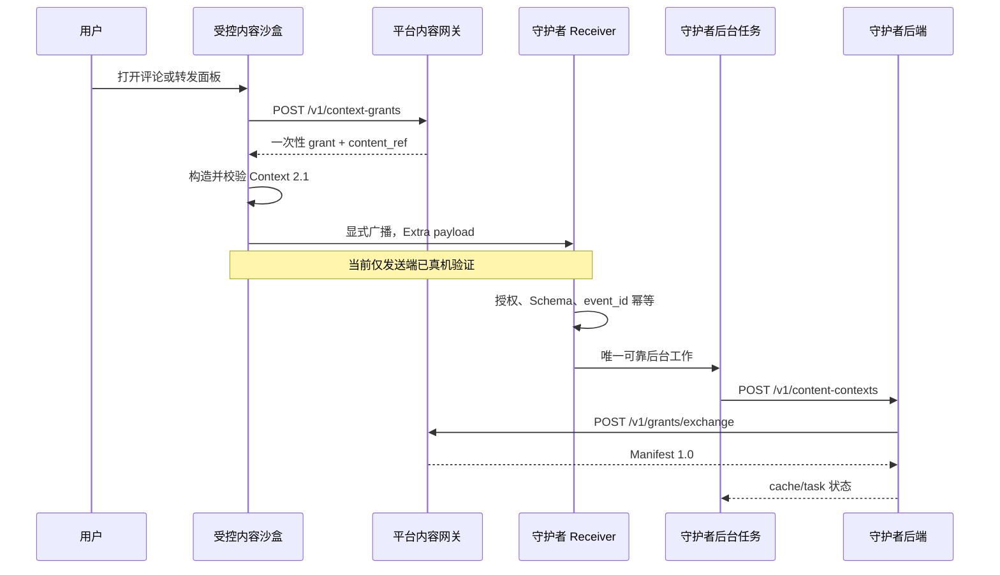

# MiMoTrust 受控内容沙盒当前协作基线

> 状态：当前实施与联调基线  
> 更新时间：2026-08-02  
> 适用团队：受控内容沙盒、守护者 App、守护者后端、平台内容网关  
> 权威关系：本文汇总当前事实，不替代冻结规格、Context 2.1 Schema 或 Manifest 1.0 Schema

## 1. 当前结论

受控内容沙盒的三视频 Android 发送端和最小平台内容网关已经完成。沙盒能够在用户
打开评论或转发面板时申请一次性 grant、生成 Context 2.1，并通过 Kotlin 向固定守护者
包发送显式广播。

当前设备尚未安装正式守护者包 `com.mimotrust.guardian`。因此发送端、网关、Payload
构造和广播调用已经真机验证，Receiver 接收、授权检查、幂等入队、后端提交和报告展示
仍待守护者侧完成。

当前不建设上传页面、上传 API、自动上传脚本、推荐系统、账号系统或核验逻辑。后期可
将手工 registry 替换为自动上架数据源，但不得因此修改已经冻结的跨系统合同。

## 2. 固定协议

| 项目 | 固定值 |
|---|---|
| 沙盒 applicationId | `com.mimotrust.controlledcontent` |
| 守护者 applicationId | `com.mimotrust.guardian` |
| Flutter MethodChannel | `com.mimotrust.controlledcontent/context` |
| Broadcast Action | `com.mimotrust.intent.action.CONTENT_CONTEXT` |
| Intent Extra | `payload` |
| Context Schema | `2.1` |
| Manifest Schema | `1.0` |
| Provider ID | `mimotrust_sandbox` |
| Audience | `mimotrust_guardian_backend` |
| `source_app` | `mimotrust_controlled_content` |
| 可选签名权限 | `com.mimotrust.permission.SEND_CONTENT_CONTEXT` |

Flutter 与 Kotlin 之间的内部方法名为 `sendContentContext`，参数是单个已序列化的
Context 2.1 JSON 字符串。它不是跨 App 协议，不允许据此创建第二套 Action、Extra 或
Payload。

Debug 联调阶段暂不启用 signature 权限。双方统一签名证书后，再共同启用固定权限。

## 3. 系统责任

| 系统 | 负责 | 不负责 |
|---|---|---|
| 受控内容沙盒 | 展示固定内容、本地互动、申请 grant、发送当前内容上下文 | 搜索、真假判断、核验任务、报告展示 |
| 平台内容网关 | 校验内容身份、签发/兑换一次性 grant、返回 Manifest | 上传页面、推荐、分析、证据检索 |
| 守护者 App | 用户授权、Receiver 校验、`event_id` 幂等、可靠入队、状态展示 | 在 `onReceive()` 中执行下载、HTTP、模型或检索 |
| 守护者后端 | 兑换 grant、读取内容、校验哈希、缓存、分析、检索、证据和任务状态 | 信任设备时间或把广播成功当作任务成功 |

## 4. 当前实施状态

| 模块 | 状态 | 当前结果 |
|---|---|---|
| Context 2.1 Schema | 完成 | 5 个合法样例通过，5 个非法样例拒绝 |
| Manifest 1.0 | 完成 | 3 个活动视频 Manifest 通过校验 |
| 最小内容网关 | 完成 | 4 个路由，内存 grant，180 秒过期，单次兑换 |
| Flutter Android App | 完成当前视频阶段 | 三视频竖向 Feed、本地互动和异常降级 |
| Flutter 到 Kotlin | 完成 | 固定 MethodChannel，单字符串 Payload |
| Kotlin 显式广播 | 完成 | 固定 Action、目标包和 Extra，32 KB 上限 |
| 守护者 Receiver | 待守护者团队完成 | 当前真机未安装 `com.mimotrust.guardian` |
| 守护者可靠入队 | 待守护者团队完成 | 需要授权、幂等存储和 WorkManager |
| 守护者后端 | 待后端团队确认 | 部署地址、认证和负责人尚未提供 |
| 文章/图文/图片 | 待扩展 | 本地素材存在，尚未加入 App Feed |
| 音频 | 阻塞于素材 | 不得生成伪造的活动 Manifest |

## 5. 当前演示内容

| 内容 | 标题 | 时长 | 分辨率 | 初始点赞/评论/转发 |
|---|---|---:|---:|---:|
| `video-001:v1` | SkyNomad 澎程事故传言 | 22.467 秒 | 720×1280 | 1284 / 86 / 214 |
| `video-002:v1` | 2026年城乡居民基础养老金月最低标准再提高20元 | 19.301 秒 | 720×1280 | 936 / 42 / 118 |
| `video-003:v1` | 未成年人网络游戏防沉迷新规 | 28.320 秒 | 720×1066 | 2456 / 173 / 367 |

完整 URL、SHA-256、资源大小和存储信息以以下文件为准：

- `sandbox/content_registry/registry.json`；
- `sandbox/content_registry/manifests/video-001.v1.json`；
- `sandbox/content_registry/manifests/video-002.v1.json`；
- `sandbox/content_registry/manifests/video-003.v1.json`。

`display_metrics` 只用于沙盒界面。点赞数叠加本机点赞状态，评论数叠加本地评论，
转发数叠加本次运行完成的模拟转发。所有互动数量均不进入 Manifest 1.0 或 Context 2.1。

## 6. 触发语义

| 用户动作 | 发送 Context | 本地效果 |
|---|---:|---|
| 浏览、播放、暂停、拖动进度 | 否 | 只改变播放状态 |
| 上下切换视频 | 否 | 切走暂停，当前页播放 |
| 页面停留、后台、恢复前台 | 否 | 执行生命周期策略 |
| 点赞或取消点赞 | 否 | 状态和数量按内容版本持久化 |
| 打开评论面板 | 是，`comment` | 展示预置和本地评论 |
| 提交本地评论 | 否 | 评论和数量保存在本机 |
| 打开转发面板 | 是，`share` | 展示固定虚拟联系人 |
| 完成模拟转发 | 否 | 本次运行的转发数加一 |

`comment` 表示“打开评论面板”，不表示提交评论；`share` 表示“打开转发面板”，不表示
分享完成。Payload 不得包含评论正文、联系人、用户稳定标识、Cookie、长期凭据、媒体
二进制、完整浏览历史或核验结论，UTF-8 编码后不得超过 32 KB。

## 7. 当前数据流



广播是单向、尽力交付，不提供业务 ACK。`sendBroadcast()` 返回不代表 Receiver 已接收，
更不代表后端已创建核验任务。

## 8. 平台内容网关合同

当前开发网关默认地址：

```text
http://127.0.0.1:8787
```

路由：

```text
GET  /health
POST /v1/context-grants
POST /v1/grants/exchange
GET  /assets/...
```

申请 grant：

```json
{
  "content_id": "video-003",
  "content_version": "v1",
  "audience": "mimotrust_guardian_backend",
  "scopes": ["manifest:read", "asset:read"]
}
```

兑换时提交 `grant_code`、`audience`、`content_id` 和 `content_version`。成功响应为：

```json
{
  "grant_id": "...",
  "manifest": { "manifest_version": "1.0" }
}
```

当前网关错误至少区分：

```text
GRANT_EXPIRED
GRANT_REPLAYED
AUDIENCE_MISMATCH
CONTENT_MISMATCH
CONTENT_UNAVAILABLE
```

开发地址和内存实现不是生产合同。后期允许替换数据源、域名和持久化实现，但必须保持
请求语义、Audience、Manifest 1.0 和单次 grant 兑换约束。

## 9. Android 广播合同

沙盒发送方式固定为：

```kotlin
Intent("com.mimotrust.intent.action.CONTENT_CONTEXT")
    .setPackage("com.mimotrust.guardian")
    .putExtra("payload", payloadJson)
```

守护者 Receiver 的最小处理顺序：

```text
验证 Action 和 payload 存在
  -> 检查用户当前授权
  -> 检查 32 KB 上限
  -> 解析 JSON 并校验 Context 2.1
  -> 以 event_id 插入唯一待处理记录
  -> 调度唯一后台上传工作
  -> 立即返回
```

`onReceive()` 不得执行 HTTP、媒体下载、数据库长事务、MiMo 调用、检索或轮询。没有
既有可靠调度方案时使用 WorkManager，唯一工作名建议为
`content-context-{event_id}`。

Receiver 至少区分：

```text
CONSENT_REQUIRED
INVALID_ACTION
PAYLOAD_MISSING
PAYLOAD_TOO_LARGE
UNSUPPORTED_SCHEMA
INVALID_FIELD
DUPLICATE_EVENT
UNSUPPORTED_CONTENT_TYPE
UNSUPPORTED_ACCESS_MODE
```

## 10. 守护者到后端合同

建议提交接口：

```http
POST /v1/content-contexts
```

```json
{
  "request_id": "8f052041-20f1-4a38-82be-5663dad7787e",
  "guardian_app_version": "0.1.0",
  "context": { "schema_version": "2.1" }
}
```

建议响应：

```json
{
  "request_id": "8f052041-20f1-4a38-82be-5663dad7787e",
  "task_id": "task-001",
  "accepted": true,
  "cache_status": "miss",
  "task_status": "queued"
}
```

任务查询：

```http
GET /v1/verification-tasks/{task_id}
```

后端部署地址、认证方式和负责人仍待后端团队提供。守护者不得在这些值未确认时自行把
开发假地址固化为生产合同。

## 11. 联调日志

统一格式：

```text
MiMoTrustSandbox:  CONTENT_CONTEXT_SEND event_id=... type=... trigger=...
MiMoTrustReceiver: CONTENT_CONTEXT_RECEIVED event_id=... type=... trigger=...
MiMoTrustReceiver: CONTENT_CONTEXT_REJECTED event_id=... reason=...
MiMoTrustGuardian: CONTEXT_UPLOAD_ENQUEUED event_id=... request_id=...
MiMoTrustGuardian: VERIFY_TASK_ACCEPTED request_id=... task_id=... cache=...
MiMoTrustGateway:  CONTENT_GRANT_EXCHANGED grant_id=... content_id=...
```

日志不得记录完整 Payload、`grant_code`、签名 URL、评论正文、联系人、Cookie 或账号
凭据。

## 12. 本地启动与联调

在仓库根目录启动网关：

```powershell
python -m sandbox.content_gateway.server --host 127.0.0.1 --port 8787
adb reverse tcp:8787 tcp:8787
```

安装当前沙盒 APK：

```powershell
adb install -r sandbox\mimotrust_controlled_content\build\app\outputs\flutter-apk\app-debug.apk
```

当前构建：

```text
大小：188045219 bytes
SHA-256：d975e6e4d9bfeb37d315d5f8aca71d755a242259e5dc51327e4749e4452e9a44
```

建议联调日志命令：

```powershell
adb logcat -c
adb logcat -s MiMoTrustSandbox:I MiMoTrustReceiver:I MiMoTrustGuardian:I *:S
```

联调前必须确认：

```powershell
adb shell pm list packages com.mimotrust.guardian
adb reverse --list
```

不得为了测试方便把目标包临时改为 `com.mimotrust.xiaozhen` 或其他包。

## 13. 当前验收证据

- Dart 静态分析：无问题；
- Flutter 测试：25/25；
- 网关测试：10/10；
- 合同校验：5 个合法 Context、5 个非法 Context、3 个活动 Manifest；
- Xiaomi `25057RA09C`，Android 16 / API 36 真机安装和播放通过；
- 三条视频竖向切换不发送 Context；
- 点赞、评论提交、模拟转发完成不发送 Context；
- 打开评论和转发面板各发送一条，`event_id` 不同；
- 守护者缺失、网关失败或媒体失败不使沙盒崩溃；
- 发送日志未出现 Payload、grant、评论、联系人或 Cookie。

详细记录和截图索引见 `sandbox/DEVICE_VERIFICATION.md`。

## 14. 下一轮协作顺序

1. 守护者团队创建或确认 `com.mimotrust.guardian` 工程，并完成 Receiver 最小日志；
2. 使用固定 ADB Payload 验证授权、合法接收、非法拒收和 `event_id` 幂等；
3. 实现本地有限待处理队列和唯一 WorkManager，不在 Receiver 中执行长任务；
4. 后端团队确认 `POST /v1/content-contexts` 地址、认证、负责人和固定假响应；
5. 守护者完成上传、缓存状态、任务状态和失败状态界面；
6. 安装正式守护者包，用沙盒真实 comment/share 替换 ADB 输入；
7. 后端兑换 grant、读取三条视频 Manifest、下载资源并校验 SHA-256；
8. 保存发送、接收、入队、兑换和任务日志，完成首条视频端到端验收；
9. 沙盒再扩展文章、图文和图片，音频等待真实素材。

## 15. 待确认事项

| 事项 | 责任方 | 当前状态 |
|---|---|---|
| 守护者工程目录和技术栈 | 守护者 App | 待确认 |
| Receiver 组件名与安装包 | 守护者 App | 待提供 |
| 用户授权状态的数据来源 | 守护者 App | 待确认 |
| 后端部署地址和认证 | 守护者后端 | 待提供 |
| `POST /v1/content-contexts` 负责人 | 守护者后端 | 待指定 |
| 报告第一版展示形态 | 守护者 App/产品 | 待确认 |
| 双方统一签名证书 | Android 双方 | 后置处理 |
| 最终命名的私有 OSS Bucket | 平台侧 | 正式演示前处理 |
| 音频真实素材 | 内容侧 | 尚未提供 |

## 16. 变更规则

- 代码与口头约定冲突时，以冻结 Schema、合同样例和冻结规格为准；
- 增加可选字段可保持 `2.x`，删除字段、改变类型或语义必须升级主版本；
- 未识别的 `trigger`、`content_type` 或访问模式必须拒收；
- 合同变更必须同步更新 Schema、正反样例、沙盒、Receiver、后端和网关测试；
- 包名、Action、Extra、Schema、Provider ID 和 Audience 不得由任一团队单方修改；
- 运行环境事实不属于协议，例如设备序列号、当前 PID、Debug 网关端口和守护者是否安装。

## 17. 关联文件

- `沙盒下阶段实现交接说明.md`；
- `MiMoTrust受控内容沙盒冻结规格.md`；
- `MiMoTrust受控内容沙盒跨系统协作文档.md`；
- `contracts/content_context.schema.json`；
- `contracts/content_manifest.schema.json`；
- `sandbox/IMPLEMENTATION_CONTRACT.md`；
- `sandbox/DEVICE_VERIFICATION.md`；
- `sandbox/content_gateway/README.md`；
- `sandbox/mimotrust_controlled_content/README.md`。
