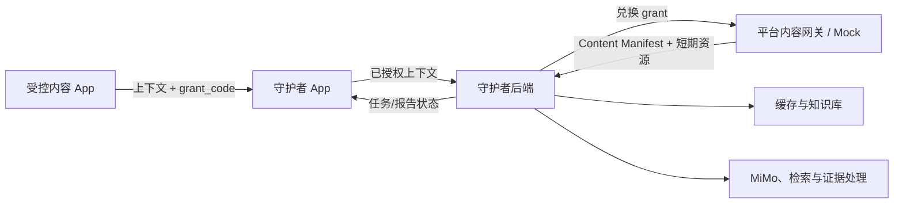

# MiMoTrust 守护者 App 跨系统协作文档

> 状态：Context 2.2 目标合同已冻结，代码迁移与联调待完成
> 文档版本：0.7
> 目标上下文协议：2.2（当前 APK、Schema、样例仍为 2.1）
> 当前实施中心：MiMoTrust 守护者 Android App  
> 更新日期：2026-08-02

本版批准“用户点击守护者悬浮球后，守护者主动向前台沙盒请求当前内容”的双向交互。`comment/share` 只提示候选，不自动获取资源；`guardian_request` 才代表用户明确发起核验。本文中的 2.2 条款覆盖旧版关于 `comment/share` 自动入队、自动兑换或单向链路的描述。

## 1. 沙盒现状与守护者的开发前提

### 1.1 沙盒定位

MiMoTrust 受控内容沙盒只用于验证“平台在用户授权后向守护者提供当前内容”这一思路。
它不是抖音复制品，不验证推荐、账号、普通用户上传、社交、审核或 CDN 能力。开发者
专用的内容管理服务只负责准备固定演示数据，不属于 Android 用户体验或跨系统协议。

沙盒应尽量接近真实的是跨系统语义，而不是内容平台规模：

```text
用户浏览当前内容
  -> 平台 App 仅在本地维护当前内容状态
  -> comment/share 可通知守护者存在候选
  -> 用户点击悬浮球，守护者主动请求当前内容
  -> 平台 App 生成当前内容引用和新鲜短期授权
  -> 守护者后端取得可分析内容
  -> 命中历史结果或启动新的核验任务
```

### 1.2 当前工作区实际状态

| 项目 | 当前状态 |
|---|---|
| 业务边界和演示场景 | 已冻结 |
| `com.mimotrust.*` 命名、Manifest 1.0 | 已冻结并已实现 |
| Context 2.1 | 当前已实现；5 个合法、5 个非法样例通过合同测试 |
| Context 2.2 主动请求 | 文档已冻结；Schema、样例、代码和测试尚未迁移 |
| 内容数据 | 3 条活动视频 Manifest 已校验；文章/图文/图片待加入 Feed，音频待真实素材 |
| 受控内容 App | 三视频 Flutter Android 发送端已完成并真机验证 |
| 平台内容网关 | 本地 Mock 已完成；180 秒内存 grant、一次兑换 |
| 守护者 App/后端 | 尚未实现或联调 |

因此，守护者 App 当前不应等待沙盒完成后再开发。守护者组先使用固定 JSON 样例、ADB 测试广播和可替换的假后端完成接收链路；沙盒完成后只替换测试输入，不修改守护者核心逻辑。

### 1.3 沙盒最终只需提供的能力

- 展示视频、音频、文章、图文和单图/多图；
- 在用户打开评论或转发面板时发送不带可用 grant 的候选上下文；
- 在前台展示有效内容时响应守护者主动请求，快照当前状态并提供新鲜 grant；
- 提供稳定内容 ID、版本、哈希和当前查看状态；
- 模拟一次性 `grant_code` 兑换 Content Manifest；
- 守护者不可用时仍正常播放、阅读和互动。

沙盒不调用 MiMo，不搜索网页，不创建核验任务，不读取评论正文或联系人，不展示核验结论。

### 1.4 守护者可依赖的稳定边界

守护者只依赖以下合同：

1. Android 上下文输入合同；
2. 守护者 App 到守护者后端的提交合同；
3. 平台内容引用和 Content Manifest 合同；
4. 守护者后端内部的 `PlatformContentAdapter` 接口。

未来获得抖音等平台授权时，替换平台上下文输入通道和 `PlatformContentAdapter`，不改动守护者的任务、缓存、检索和报告主链。

## 2. 当前实施目标：守护者 App

当前阶段只实施 MiMoTrust 守护者 Android App 与必要的后端交接。优先完成：

```text
comment/share 候选通知
  -> 验证并保存候选，使悬浮球进入 AVAILABLE/闪烁
用户点击悬浮球
  -> 守护者请求前台沙盒当前上下文
  -> 验证 guardian_request 响应和用户授权
  -> 本地幂等入队
  -> 提交守护者后端
  -> 获得缓存/任务状态
  -> 在守护者自身界面展示
```

### 2.1 守护者 App 负责

- 提供明确的当前内容核验授权开关和授权说明；
- 提供悬浮球、必要的悬浮窗权限引导、前台服务，并在不可悬浮时提供通知入口；
- 注册候选/响应 `BroadcastReceiver`，发送主动请求并管理 3–5 秒超时；
- 校验 Action、Schema、必填字段、枚举、长度和范围；
- 未授权时拒绝消费，不兑换 grant；
- 对 `request_id/event_id` 幂等去重；候选只保存，只有合法 `guardian_request` 响应可靠入队；
- 将原始上下文和守护者请求 ID 提交后端；
- 处理缓存命中、分析中、完成、失败和证据不足状态；
- 在自身页面或后续确认的系统能力中展示状态和报告；
- 不因单条错误事件、后端不可用或沙盒缺失而崩溃。

### 2.2 守护者 App 不负责

- 不在 `onReceive()` 中下载媒体、调用 MiMo 或执行检索；
- 不直接访问平台分析资源，grant 由守护者后端兑换；
- 不根据评论或转发动作自动阻断用户；
- 不使用普通模型回复代替有证据的核验报告；
- 不把设备时间、客户端哈希或广播成功当作服务端信任依据。

## 3. 跨系统责任边界



### 3.1 守护者后端

- 服务端再次校验上下文，不信任客户端校验结果；
- 优先根据内容身份查询缓存和进行中任务；
- 仅在需要新分析时兑换 grant；
- 通过 `PlatformContentAdapter` 取得并校验 Content Manifest；
- 按内容类型执行预处理、MiMo 理解、主张拆分、检索和证据分析；
- 维护任务、报告、缓存、来源固化和知识库；
- 对下架、授权撤回、资源过期和哈希不匹配执行明确降级。

### 3.2 平台内容网关 / Mock

- 签发限时、一次性、绑定 audience 的 `grant_code`；
- 兑换成功后返回版本化 Content Manifest 和短期分析资源；
- 拒绝过期、重放、内容不匹配和 audience 不匹配；
- 在沙盒中可使用静态 JSON 和内存/SQLite 实现；
- 不执行核验任务，不接收核验结果。

## 4. 品牌与固定标识符

对外产品名和英文标识统一为 `MiMoTrust`，完整展示名为“MiMoTrust · 信源守护者”。技术说明中可写“基于 Xiaomi MiMo 的多模态信源核验助手”。

下表中的 `mimotrust` 是 `MiMoTrust` 的统一小写技术标识，用于 applicationId、Action、Provider ID、audience 和 Schema URI。大小写形式固定，不再引入其他品牌派生标识。

| 项目 | 固定值 |
|---|---|
| 沙盒 applicationId | `com.mimotrust.controlledcontent` |
| 守护者 applicationId | `com.mimotrust.guardian` |
| 沙盒 MethodChannel | `com.mimotrust.controlledcontent/context` |
| 守护者请求 Action | `com.mimotrust.intent.action.REQUEST_CONTENT_CONTEXT` |
| 请求目标包 / Extra | `com.mimotrust.controlledcontent` / `request_id` |
| 沙盒响应与候选 Action | `com.mimotrust.intent.action.CONTENT_CONTEXT` |
| 响应目标包 / Extra | `com.mimotrust.guardian` / `payload` |
| 目标上下文 Schema | `2.2` |
| 当前实现 Schema | `2.1`（迁移期只读兼容） |
| Content Manifest Schema | `1.0` |
| 沙盒 Provider ID | `mimotrust_sandbox` |
| 守护者后端 audience | `mimotrust_guardian_backend` |
| 可选签名权限 | `com.mimotrust.permission.SEND_CONTENT_CONTEXT` |
| 发送端日志标签 | `MiMoTrustSandbox` |
| Receiver 日志标签 | `MiMoTrustReceiver` |
| 守护者日志标签 | `MiMoTrustGuardian` |

在技术标识最终冻结前，不新增更多由品牌名派生的标识。更换 applicationId、Action、Extra、Schema URI 或字段语义都属于破坏性变更，必须由沙盒、守护者 App、守护者后端和平台网关共同确认并同步迁移。

## 5. Android 上下文输入合同

### 5.1 双向发送方式

用户点击悬浮球后，守护者生成 UUID 并向沙盒发送指定目标包的显式请求：

```kotlin
Intent("com.mimotrust.intent.action.REQUEST_CONTENT_CONTEXT")
    .setPackage("com.mimotrust.controlledcontent")
    .putExtra("request_id", requestId)
```

沙盒只在 `MainActivity` 为 resumed 且正在展示有效内容时响应。其请求 Receiver 必须动态注册，并在 `onPause()`/`onStop()` 对应阶段注销。沙盒通过 Kotlin 向守护者发送指定目标包的显式响应：

```kotlin
Intent("com.mimotrust.intent.action.CONTENT_CONTEXT")
    .setPackage("com.mimotrust.guardian")
    .putExtra("payload", payloadJson)
```

两次广播各自都是尽力交付，不提供业务 ACK。`sendBroadcast()` 成功不等于对方已接收，更不等于守护者已创建任务。守护者等待响应 3–5 秒；超时后进入 `FAILED`/不可用状态，不自动重试或抓取屏幕。

### 5.2 `guardian_request` Payload 2.2

```json
{
  "schema_version": "2.2",
  "event_id": "2ce1c877-0245-4c31-9fd8-a39bd76900d1",
  "trigger": "guardian_request",
  "source_app": "mimotrust_controlled_content",
  "provider": {
    "provider_id": "mimotrust_sandbox",
    "application_id": "com.mimotrust.controlledcontent"
  },
  "content_ref": {
    "content_type": "video",
    "content_id": "video-001",
    "content_version": "v1",
    "content_hash": "0123456789abcdef0123456789abcdef0123456789abcdef0123456789abcdef",
    "canonical_url": "https://<platform-domain>/video/video-001"
  },
  "content_access": {
    "mode": "grant_exchange",
    "exchange_url": "https://<gateway-domain>/v1/grants/exchange",
    "grant_code": "one-time-code",
    "audience": "mimotrust_guardian_backend",
    "expires_at": "2026-08-01T14:05:00+08:00",
    "scopes": ["manifest:read", "asset:read"]
  },
  "view_state": {
    "position_ms": 3500,
    "duration_ms": 22000,
    "is_playing": true
  },
  "observed_at": "2026-08-01T14:00:00+08:00"
}
```

`event_id` 必须逐字等于守护者请求中的 `request_id`。沙盒在收到请求后才申请 grant；不得复用候选通知或上一次请求中的 grant。

`comment/share` 候选同样使用 Context 2.2 的内容身份和查看状态，但其 `content_access` 固定为：

```json
{
  "mode": "deferred_grant"
}
```

候选 Payload 不得出现 `grant_code`、`exchange_url`、`expires_at` 或 `scopes`。候选的 `event_id` 仍为沙盒生成的唯一 UUID。

### 5.3 必填与枚举

| 字段 | 约束 |
|---|---|
| `schema_version` | 目标为 `2.2`；迁移期守护者兼容读取 `2.1` |
| `event_id` | 每次事件唯一 UUID；`guardian_request` 时等于请求 `request_id` |
| `trigger` | `comment/share/guardian_request` |
| `provider` | 内容提供方身份 |
| `content_ref` | 稳定内容引用 |
| `content_access` | 访问模式与短期授权 |
| `view_state` | 当前查看位置 |
| `observed_at` | 带时区 ISO 8601 设备观察时间 |

`content_type` 允许：

```text
video | audio | article | rich_article | image_gallery
```

`content_access.mode` 允许：

```text
deferred_grant | grant_exchange | public_manifest | content_uri
```

`deferred_grant` 只允许用于 `comment/share`；`grant_exchange` 是 `guardian_request` 主演示路径。`public_manifest` 只用于开发降级，`content_uri` 保留给未来系统授权的本地内容。

### 5.4 查看状态约束

- 视频/音频：`position_ms`、`duration_ms`、`is_playing`；
- 文章/图文：`scroll_ratio`、`block_index`；
- 图片画廊：`active_asset_index`、`asset_count`。

`position_ms` 必须在 `[0, duration_ms]` 内，`scroll_ratio` 必须在 `[0, 1]` 内，图片下标必须落在实际资源数量内。`view_state` 用于定位用户当前看到的部分，默认分析范围仍是完整内容。

### 5.5 禁止内容

Payload 不得包含评论正文、联系人、用户稳定标识、Cookie、长期令牌、对象存储密钥、媒体二进制、完整浏览历史或核验结论。Payload 不得超过 32 KB。

## 6. 双向 Receiver 与可靠入队

### 6.1 Manifest 约束

守护者 Receiver 必须启用、对约定发送方可见，并且只监听 `CONTENT_CONTEXT`。沙盒请求 Receiver 只在主界面 resumed 时动态注册，只监听 `REQUEST_CONTENT_CONTEXT`。Debug 联调可先不开启 signature 权限；双方统一签名证书后，两个方向共同启用：

```text
com.mimotrust.permission.SEND_CONTENT_CONTEXT
```

### 6.2 守护者 `onReceive()` 处理顺序

```text
验证 Action 和 payload 存在
  -> 验证用户当前授权
  -> 解析 JSON 并执行 Schema 校验
  -> comment/share: 以 event_id 去重保存候选，使悬浮球 AVAILABLE/闪烁，立即返回
  -> guardian_request: 校验 event_id 等于待处理 request_id
  -> 尝试插入唯一 event_id 的本地待处理记录
  -> 调度唯一后台上传工作，立即返回
```

沙盒请求 Receiver 的处理顺序：

```text
验证 Action、request_id UUID 和 Activity resumed
  -> Flutter 主线程快照当前 content_ref 与 view_state
  -> 无有效内容则不响应
  -> 向网关申请绑定当前内容的新鲜 grant
  -> 构造 Context 2.2: trigger=guardian_request, event_id=request_id
  -> 显式广播给 com.mimotrust.guardian
  -> 立即返回
```

守护者 `onReceive()` 中不允许执行 HTTP、媒体下载、数据库长事务、MiMo 调用或轮询。后续提交使用现有的可靠工作调度方案；如无现有方案，Android 默认使用 WorkManager。沙盒申请 grant 属于对用户明确请求的短操作，应异步执行并受超时约束，不阻塞 Android Receiver 回调。

### 6.3 幂等约束

- `event_id` 是事件幂等键，本地存储建立唯一约束；
- `guardian_request` 中 `request_id = event_id`，同时作为请求关联键和端到端幂等键；
- WorkManager 的唯一工作名建议为 `content-context-{event_id}`；
- 悬浮球点击需做防抖；同一待处理 `request_id` 的重复响应或广播不重复上传；
- `comment/share` 不创建上传 WorkManager；
- 后端仍必须独立执行 `event_id` 幂等；
- `event_id` 不是内容身份，不能用于报告缓存。

## 7. 守护者 App 到后端合同

### 7.1 最小提交接口

建议使用：

```http
POST /v1/content-contexts
```

请求体保留原始上下文，另增加守护者请求 ID 和 App 版本：

```json
{
  "request_id": "8f052041-20f1-4a38-82be-5663dad7787e",
  "guardian_app_version": "0.1.0",
  "context": { "schema_version": "2.2", "trigger": "guardian_request" }
}
```

不上传设备稳定标识、评论正文或联系人。用户授权是守护者发起请求的前置条件，后端仍使用守护者自身的身份认证和审计机制。

### 7.2 接收响应

后端至少返回：

```json
{
  "request_id": "8f052041-20f1-4a38-82be-5663dad7787e",
  "task_id": "task-001",
  "accepted": true,
  "cache_status": "miss",
  "task_status": "queued"
}
```

`cache_status` 建议固定为：

```text
exact_hit | historical_hit | in_progress | miss
```

`task_status` 建议固定为：

```text
queued | acquiring_content | analyzing | retrieving | completed |
insufficient_evidence | content_unavailable | failed
```

只有 `guardian_request` 会提交到后端。若同内容已有任务，后端复用任务，不创建第二个完整分析任务。

### 7.3 任务状态读取

开发和演示阶段优先使用简单查询：

```http
GET /v1/verification-tasks/{task_id}
```

守护者只在自身界面可见或需要刷新提示时查询，不在后台高频轮询。WebSocket、推送和复杂订阅不是当前沙盒的必需能力。

## 8. 内容访问与平台适配

### 8.1 平台适配器

守护者后端使用统一边界：

```text
PlatformContentAdapter
  exchangeGrant(context) -> ContentManifest
  renewAccess(manifest)   -> ContentManifest
```

当前使用 `SandboxAdapter`。未来对接经授权的真实平台时，增加对应 Adapter，不要将抖音、B 站或其他平台特有字段渗透到核验主链。

### 8.2 Content Manifest 1.0

Manifest 是守护者实际分析范围的权威快照，至少包含：

- `provider_id`、`content_id`、`content_version`、`content_hash`；
- 内容类型、标题、作者和发布时间；
- 有序文本块或图片列表；
- 资源 `asset_id`、`role`、MIME、大小、SHA-256 和短期 URL；
- 音视频时长、图片尺寸和必要的派生关系；
- 访问用途、保留时间、转授限制和缺失范围。

媒体资源不依赖 Cookie、Referer 或平台登录态。守护者后端必须使用流式下载、限制最大字节数、校验 MIME 和 SHA-256，并限制可访问域名。

## 9. 触发语义与守护者决策

普通浏览、播放和页面停留不发送上下文，也不自动创建分析任务。沙盒不实现停留计时器。

### 9.1 `comment`

`comment` 表示用户打开评论面板，不表示已提交评论，不传输评论正文。守护者校验后只保存候选并使悬浮球进入 `AVAILABLE`/闪烁，不提交后端、不兑换 grant、不阻塞评论面板。

### 9.2 `share`

`share` 表示用户打开转发面板，不表示分享完成，不传输联系人或转发目标。守护者只保存候选并提示悬浮球；用户取消转发不改变该事件语义。

### 9.3 `guardian_request`

`guardian_request` 表示用户明确点击守护者悬浮球请求核验当前内容。它不依赖先前出现过 `comment/share`。守护者先广播请求，沙盒按响应瞬间而非候选通知瞬间快照当前内容和查看状态，并返回新鲜 grant。

悬浮球状态固定为：

```text
IDLE -> AVAILABLE -> REQUESTING -> PROCESSING -> READY
                               \-> FAILED
```

`AVAILABLE` 可由候选通知触发，但 `IDLE` 状态下用户仍可点击并进入 `REQUESTING`。超时、沙盒不在前台、无有效内容或申请 grant 失败进入 `FAILED`，界面显示不可用并允许用户稍后重试。

### 9.4 守护者决策表

| 条件 | 处理 |
|---|---|
| 用户未授权 | 本地拒绝，不上传、不兑换 grant |
| 协议或字段非法 | 拒收并记录稳定原因码 |
| 收到 `comment/share` | 保存/更新候选，提示悬浮球；不提交、不兑换 |
| 用户点击悬浮球 | 生成 `request_id`，请求沙盒，进入 `REQUESTING` |
| 3–5 秒无响应 | 进入 `FAILED`，提示当前内容不可用 |
| 收到匹配的 `guardian_request` | 幂等入队并提交后端，进入 `PROCESSING` |
| 精确缓存命中 | 返回已有报告；后端可不兑换 grant |
| 同内容任务进行中 | 复用任务，不创建第二个分析任务 |
| 未命中且无任务 | 后端兑换 grant 并创建任务 |
| 内容不可用 | 返回降级状态，不猜测未取得的内容 |

## 10. 缓存与知识库边界

缓存和知识库由守护者后端管理，不由沙盒或 Receiver 管理。

精确报告缓存键至少包含：

```text
provider_id
+ content_id
+ content_version/content_hash
+ model_version
+ analysis_pipeline_version
+ evidence_policy_version
```

兑换 Manifest 后，以服务端验证过的内容哈希和 Manifest 摘要为准。URL 变化不应导致缓存失效，内容版本或模型/流程版本变化必须重新评估。

知识库可复用内容指纹、原子主张、来源快照、转载关系和证据关系。知识库相似命中不等于当前报告已核验，还必须检查上下文、时效和当前证据状态。

## 11. 安全、隐私与失败约定

- 广播发送方必须使用 `setPackage()`；
- 守护者必须在本地授权通过后才上传上下文；
- 守护者后端必须使用域名白名单、重定向限制、字节数上限和 MIME 校验防止 SSRF 与资源滥用；
- 日志不记录完整 grant、签名 URL、评论、联系人和账号凭证；
- 设备时间 `observed_at` 只用于展示和诊断；
- 后端不可用时，守护者保留有限待处理队列并按网络策略重试；
- grant 过期、已兑换、内容下架、哈希不匹配必须使用可区分错误码；
- 任何内容取得失败都不允许根据不完整输入生成完整结论。

## 12. 协议兼容与变更规则

- 迁移期守护者必须同时接受 Context 2.1 和 2.2；发送端迁移完成后默认发送 2.2；
- Context 2.1 `comment/share` 中即使存在 `grant_exchange` 也只按候选处理，不自动上传、兑换或下载；
- 不得把悬浮球点击映射或伪装为 `comment/share`；
- 增加可选字段可保持 `2.x`；
- 删除字段、修改语义或字段类型必须升级主版本；
- 未识别的可选字段由接收端忽略；
- 未识别的 `trigger`、`content_type` 或访问模式由接收端拒收；
- 合同变更必须同时更新 JSON Schema、样例、发送端、Receiver、后端和网关测试；
- 代码与文档冲突时，以已冻结的 Schema 和合同样例为准，不以口头约定为准。

应建立：

```text
contracts/content_context.schema.json
contracts/content_manifest.schema.json
contracts/examples/video.json
contracts/examples/audio.json
contracts/examples/article.json
contracts/examples/rich_article.json
contracts/examples/image_gallery.json
```

## 13. 联调日志与错误码

统一日志格式：

```text
MiMoTrustSandbox:  CONTENT_CONTEXT_SEND event_id=... type=... trigger=...
MiMoTrustGuardian: CONTENT_CONTEXT_REQUEST request_id=...
MiMoTrustSandbox:  CONTENT_CONTEXT_REQUEST_RECEIVED request_id=...
MiMoTrustReceiver: CONTENT_CONTEXT_RECEIVED event_id=... type=... trigger=...
MiMoTrustReceiver: CONTENT_CONTEXT_REJECTED event_id=... reason=...
MiMoTrustGuardian: CONTEXT_UPLOAD_ENQUEUED event_id=... request_id=...
MiMoTrustGuardian: VERIFY_TASK_ACCEPTED request_id=... task_id=... cache=...
MiMoTrustGateway:  CONTENT_GRANT_EXCHANGED grant_id=... content_id=...
```

Receiver 至少区分：

```text
CONSENT_REQUIRED
INVALID_ACTION
PAYLOAD_MISSING
PAYLOAD_TOO_LARGE
UNSUPPORTED_SCHEMA
INVALID_FIELD
DUPLICATE_EVENT
REQUEST_TIMEOUT
REQUEST_ID_MISMATCH
SANDBOX_NOT_ACTIVE
NO_ACTIVE_CONTENT
UNSUPPORTED_CONTENT_TYPE
UNSUPPORTED_ACCESS_MODE
```

后端/网关至少区分：

```text
GRANT_EXPIRED
GRANT_REPLAYED
AUDIENCE_MISMATCH
CONTENT_MISMATCH
CONTENT_UNAVAILABLE
ASSET_DOWNLOAD_FAILED
HASH_MISMATCH
```

## 14. 守护者实际构建顺序

1. 创建守护者空工程并在真机运行；
2. 实现用户授权、悬浮窗权限引导、前台服务和通知入口降级；
3. 实现悬浮球六态 UI、点击防抖、`request_id` 和 3–5 秒超时；
4. 实现 `REQUEST_CONTENT_CONTEXT` 显式广播和响应 Receiver 最小日志；
5. 实现 Context 2.2 模型、校验、错误码，并兼容读取 2.1；
6. 区分候选与请求响应：`comment/share` 只保存候选，`guardian_request` 才可靠入队；
7. 实现 `event_id/request_id` 唯一约束和唯一 WorkManager；
8. 接入 `POST /v1/content-contexts`、固定假响应和状态界面；
9. 沙盒实现 resumed 动态 Receiver、状态快照和新鲜 grant 响应；
10. 与网关、真后端和三类查看状态进行端到端真机验收。

前 8 步可使用 ADB 固定请求/响应独立开发，不依赖沙盒 2.2 迁移完成。

## 15. 联调与验收矩阵

### 15.1 守护者 App 单独验收

1. 悬浮球和通知入口能发出带 UUID `request_id` 的固定显式请求；
2. 合法 2.2 响应和迁移期 2.1 候选均能被 Receiver 接收；
3. 未授权时不上传上下文；`comment/share` 在已授权时也不上传；
4. 错误 Schema、请求 ID 不匹配、无效哈希和未知内容类型被拒收；
5. 重复点击、重复 `event_id` 或重复响应不重复上传；
6. 超时后从 `REQUESTING` 进入 `FAILED`，无无限等待；
7. Receiver 不执行长任务；断网后合法请求响应进入有限待处理队列；
8. 后端恢复后重试不重复创建任务，状态可区分缓存命中、分析中、完成和失败。

### 15.2 端到端验收

1. 五种内容类型均能响应主动请求并通过校验；
2. `comment/share` 只提示候选，单纯停留不产生跨 App 事件，三者均不自动获取资源；
3. 无候选历史时，只要沙盒前台有内容，点击悬浮球仍能得到响应；
4. 沙盒退后台或无有效内容时，守护者在 3–5 秒内显示不可用；
5. 响应中的音视频位置、文章阅读进度和图片下标是请求时的当前状态；
6. 正常 grant 只兑换一次；过期、重放和 audience 错误被拒绝；
7. 连续点击或重复响应只产生一个后端请求/任务；
8. 后端能下载分析资源并校验 SHA-256；首次未命中、再次相同内容精确命中；
9. URL 变化但版本/哈希不变时仍可命中，内容或流程版本变化后重新评估；
10. 沙盒、网关或后端不可用时，守护者给出可理解状态且双方不崩溃。

## 16. 交付物与停止条件

守护者 App 阶段交付：

- Debug APK 及 SHA-256；
- Payload 2.2 JSON Schema、正反样例和 2.1 兼容测试；
- ADB 主动请求、候选和响应命令；
- Receiver 成功、拒收、入队和后端提交日志；
- 缓存命中与未命中的实测记录；
- 真机录屏和已知风险清单。

当守护者已能稳定接收合同输入、幂等提交、取得缓存/任务状态并完成真机联调后，立即
冻结跨系统链路。不因沙盒演示继续增加推荐、社交、普通用户上传、复杂网关或平台化能力；
开发者内容管理工具不得改变该链路。

## 17. 仍待联调确认

`com.mimotrust.*`、双向 Broadcast Action/Extra、Context Schema 2.2、Manifest
Schema 1.0、Provider ID 和 audience 已于 2026-08-02 固定。当前实现仍为 2.1，完成 Schema、样例、代码和测试迁移前不得声称 2.2 已交付。后续仍需联调确认：

1. 守护者 App 最终技术栈和新建目录；
2. 守护者后端 `POST /v1/content-contexts` 的部署地址、认证方式和负责人；
3. 目标真机厂商对悬浮窗、前台服务和通知权限的具体限制；
4. 目标真机、Android 版本和最终签名证书。

Debug 联调阶段暂不启用 signature 权限；双方统一签名证书后再启用。接口合同冻结后只修复阻断性问题，不由任何一方单方改变跨系统合同。
