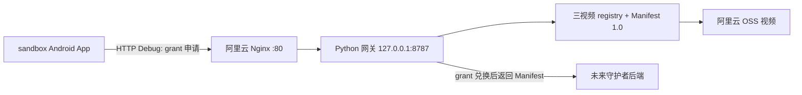

# MiMoTrust 受控内容沙盒首轮交付报告

> 交付日期：2026-08-02
> 交付范围：三视频 Android 受控内容沙盒、最小内容网关、阿里云 Debug 部署
> 交付结论：当前范围通过；完整守护者与 Context 2.2 端到端链路尚未交付

## 1. 交付结论

本轮已经交付可安装的 Android 沙盒 App、三条固定视频、Manifest 1.0 内容注册表、
Context 2.1 发送端、最小 grant 网关及阿里云 ECS Debug 环境。真机不使用 `adb reverse`
即可从云端网关申请 grant，并在打开评论面板时构造上下文和执行显式广播。

本轮没有交付守护者 App、守护者后端、核验任务或报告。已批准的 Context 2.2
“悬浮球主动请求当前内容”目前只完成文档冻结，Schema、样例和代码仍待迁移。因此本报告
只判定“三视频沙盒发送端 + 云端网关”通过，不判定完整跨系统核验闭环通过。

## 2. 交付物

| 交付物 | 状态 | 位置或结果 |
|---|---|---|
| Android 沙盒 App | 已交付 | 三视频竖向 Feed、本地点赞/评论/模拟转发、异常降级 |
| Android 启动器名称 | 已交付 | `sandbox` |
| Debug APK | 已交付 | `sandbox/mimotrust_controlled_content/build/app/outputs/flutter-apk/app-debug.apk` |
| 三条视频 | 已交付 | `video-001:v1`、`video-002:v1`、`video-003:v1` |
| Manifest 1.0 | 已交付 | 3 条活动 Manifest 通过校验 |
| Context 2.1 | 已交付 | Dart 模型、MethodChannel、Kotlin 显式广播 |
| 最小内容网关 | 已交付 | 健康检查、grant 签发、一次兑换、本地资产读取 |
| 阿里云 Debug 网关 | 已部署 | `http://47.94.58.72`，Nginx `:80` 代理 Python `127.0.0.1:8787` |
| 云端构建配置 | 已交付 | `sandbox/mimotrust_controlled_content/config/cloud-debug.json` |
| 自动化验证 | 已交付 | Flutter 25/25、网关 10/10、合同正反样例通过 |
| 真机证据 | 已交付 | Xiaomi `25057RA09C`，Android 16 / API 36 |

## 3. 固定标识

Android 显示名称已按要求改为 `sandbox`，其他合同保持不变：

```text
Launcher label: sandbox
applicationId: com.mimotrust.controlledcontent
Guardian package: com.mimotrust.guardian
MethodChannel: com.mimotrust.controlledcontent/context
Response Action: com.mimotrust.intent.action.CONTENT_CONTEXT
Response Extra: payload
Current Context Schema: 2.1
Target Context Schema: 2.2
Manifest Schema: 1.0
Provider ID: mimotrust_sandbox
Audience: mimotrust_guardian_backend
```

## 4. 当前部署



ECS 上 Python 网关由 systemd 常驻运行，公网只开放 Nginx `80`，不开放 `8787`。
2026-08-02 交付检查时 `/health` 返回：

```json
{"status":"ok","provider_id":"mimotrust_sandbox","manifest_version":"1.0","content_count":3}
```

## 5. 当前运行流程

当前 APK 仍执行 Context 2.1 流程：

```text
普通浏览/播放/切页
  -> 不申请 grant，不发送 Context

打开评论或转发面板
  -> App 向 http://47.94.58.72/v1/context-grants 申请 grant
  -> 校验内容 ID、版本、哈希、audience 和 scopes
  -> 构造 Context 2.1
  -> Kotlin 向 com.mimotrust.guardian 发送显式 CONTENT_CONTEXT 广播
  -> 守护者缺失时不阻塞沙盒互动
```

点赞、提交本地评论、完成模拟转发、停留和切换视频均不发送 Context。

## 6. 验收证据

| 检查项 | 结果 |
|---|---|
| Dart 静态分析 | 无问题 |
| Flutter 测试 | 25/25 通过 |
| 网关测试 | 10/10 通过 |
| Context 合同 | 5 个合法样例通过，5 个非法样例拒绝 |
| Manifest 合同 | 3 个活动视频通过 |
| 公网网关 | 健康检查通过，内容数量为 3 |
| grant 链路 | 签发、兑换、下载、SHA-256、重放拒绝通过 |
| 真机安装 | 覆盖安装成功 |
| 真机播放 | 三视频首屏和播放正常 |
| 本地端口依赖 | `adb reverse --list` 为空 |
| 真机触发 | 打开评论面板后记录 `trigger=comment` 的 `CONTENT_CONTEXT_SEND` |
| App 标题 | APK 清单确认 `application-label='sandbox'` |

公网首视频验证结果：

```text
content_id: video-001
size_bytes: 2423227
sha256: 0f6c57d2f3f2772a3abfde87b52123c45228a420e40cada19035dd26afa2f734
second exchange: GRANT_REPLAYED
```

## 7. APK

```text
文件：sandbox/mimotrust_controlled_content/build/app/outputs/flutter-apk/app-debug.apk
版本：0.1.0+1
大小：188045219 bytes
SHA-256：8fc845ef522546133106e6a5dd28e6220eb49761582f68d7fa95554345add5c0
网关：http://47.94.58.72
```

复现构建：

```powershell
cd sandbox\mimotrust_controlled_content
flutter build apk --debug --dart-define-from-file=config/cloud-debug.json
```

## 8. 未交付与风险

| 项目 | 当前状态 | 影响 |
|---|---|---|
| 守护者 App | 未实现/未安装 | 无 Receiver 接收、悬浮球、授权、幂等队列或结果 UI |
| 守护者后端 | 未联调 | 无缓存、分析、检索、证据和报告闭环 |
| Context 2.2 | 文档已冻结，代码未迁移 | 当前仍是 comment/share 触发的 2.1 发送端 |
| HTTPS | 未配置 | 公网 IP 使用明文 HTTP，只允许 Debug 联调 |
| grant 持久化 | 进程内存 | 网关重启后丢失，不能部署多实例 |
| 网关认证/限流 | 未生产化 | 当前公网接口只适用于受控演示 |
| OSS 视频地址 | 仍含旧开发 Bucket 名 | 正式演示前应迁移到最终命名 Bucket/域名 |
| Manifest 封面 URL | 仍是 `127.0.0.1` | App 使用打包封面不受影响；未来后端不能读取该封面 |
| 其他内容类型 | 暂不实施 | 当前按确认范围只交付三视频 |
| 自动上传/自动上架 | 未实施 | 当前继续由开发者手工上传 OSS 和维护 Manifest |

## 9. 下一阶段入口

1. 将 Context Schema、正反样例和发送端迁移到 2.2；
2. 创建守护者 App，完成授权、悬浮球、主动请求、超时和防抖；
3. 沙盒增加仅前台注册的请求 Receiver，并在请求时申请新鲜 grant；
4. 守护者只对 `guardian_request` 响应可靠入队和提交后端；
5. 配置 HTTPS 域名，将内存 grant 迁移到 Redis 原子单次兑换；
6. 安装正式守护者包，完成 App、守护者、后端和网关真机闭环。

## 10. 验收结论

三视频受控内容沙盒、云端 Debug 网关、APK 构建与当前 Context 2.1 发送端达到本轮交付
范围，可以作为守护者开发和 Context 2.2 迁移的稳定输入。完整 MiMoTrust 核验系统仍不
满足最终验收条件，必须完成第 8 节列出的守护者、后端、2.2 和 HTTPS 工作后重新验收。
