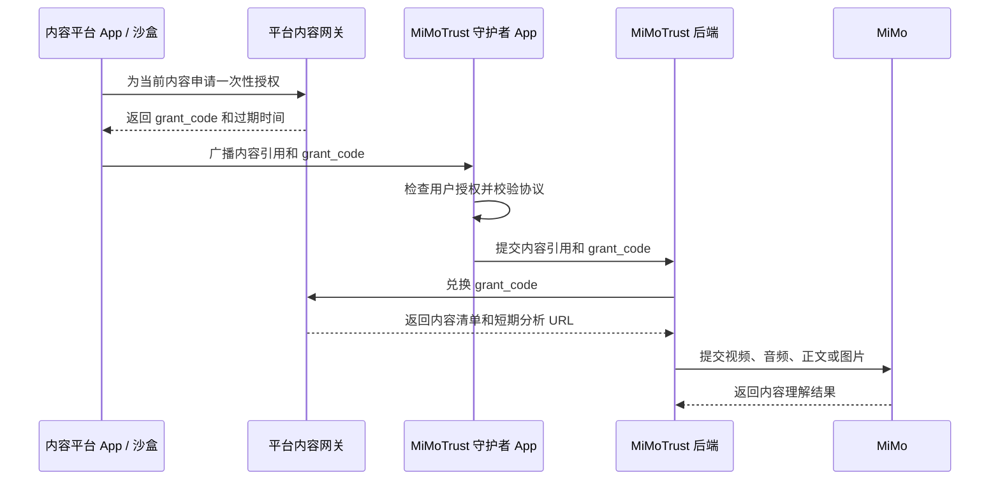

# MiMoTrust 平台内容传输技术方案

> 状态：待确认  
> 文档版本：0.4  
> 上下文协议：2.1  
> 更新日期：2026-08-01

## 1. 目标

本方案用于模拟真实短视频、资讯和内容平台向 MiMoTrust 提供可分析原资源的协作方式。

对外名称和英文标识统一为 `MiMoTrust`，代码和协议统一使用小写技术标识 `mimotrust`。

核心原则：

- 平台发送内容引用和短期访问授权，不发送媒体二进制；
- 守护者 App 负责授权判断和事件接收；
- 守护者后端通过平台内容网关取得分析资源；
- 沙盒不调用核验后端，也不接收核验结果；
- 公共 OSS URL 只作为开发和故障降级路径。

## 2. 系统架构



## 3. Android 接口

| 项目 | 固定值 |
|---|---|
| 沙盒 applicationId | `com.mimotrust.controlledcontent` |
| 守护者 applicationId | `com.mimotrust.guardian` |
| MethodChannel | `com.mimotrust.controlledcontent/context` |
| Broadcast Action | `com.mimotrust.intent.action.CONTENT_CONTEXT` |
| Intent Extra | `payload` |
| `source_app` | `mimotrust_controlled_content` |

发送方式：

```kotlin
Intent("com.mimotrust.intent.action.CONTENT_CONTEXT")
    .setPackage("com.mimotrust.guardian")
    .putExtra("payload", payloadJson)
```

广播为单向、尽力交付，不提供业务 ACK。守护者缺失或接收失败不得影响平台 App 的播放、阅读、评论和转发。

## 4. 上下文协议 2.1

```json
{
  "schema_version": "2.1",
  "event_id": "2ce1c877-0245-4c31-9fd8-a39bd76900d1",
  "trigger": "comment",
  "source_app": "mimotrust_controlled_content",
  "provider": {
    "provider_id": "mimotrust_sandbox",
    "application_id": "com.mimotrust.controlledcontent"
  },
  "content_ref": {
    "content_type": "video",
    "content_id": "video-001",
    "content_version": "v1",
    "content_hash": "0123456789abcdef0123456789abcdef0123456789abcdef0123456789abcdef",
    "canonical_url": "https://<platform-domain>/video/video-001"
  },
  "content_access": {
    "mode": "grant_exchange",
    "exchange_url": "https://<gateway-domain>/v1/grants/exchange",
    "grant_code": "one-time-code",
    "audience": "mimotrust_guardian_backend",
    "expires_at": "2026-08-01T14:05:00+08:00",
    "scopes": ["manifest:read", "asset:read"]
  },
  "view_state": {
    "position_ms": 3500,
    "duration_ms": 22000,
    "is_playing": true
  },
  "observed_at": "2026-08-01T14:00:00+08:00"
}
```

固定枚举：

```text
content_type:
video | audio | article | rich_article | image_gallery

trigger:
comment | share

content_access.mode:
grant_exchange | public_manifest | content_uri
```

## 5. 内容访问模式

### 5.1 grant_exchange

正式演示默认模式。平台签发一次性 `grant_code`，守护者后端兑换后取得内容清单和短期分析 URL。

要求：

- 有效期 2 至 5 分钟；
- 一次性使用；
- 绑定指定 audience；
- 只允许访问指定内容和版本；
- 不在 Logcat 中打印完整授权码；
- 资源过期后由守护者后端通过网关续期。

### 5.2 public_manifest

开发和降级模式。上下文直接提供公共 HTTPS 内容清单。适合快速排查模型下载和媒体格式问题，不作为真实授权链路的主要证明。

### 5.3 content_uri

未来本地文件或系统级 Android 接口使用。平台通过 `ContentProvider` 临时授予守护者读取权限，守护者再将内容转存至受控短期存储。广播本身仍不携带二进制。

## 6. 平台内容网关

沙盒只需模拟以下最小接口：

```text
POST /v1/context-grants
POST /v1/grants/exchange
POST /v1/grants/renew
GET  /v1/manifests/{content_id}/{version}
```

兑换成功响应示例：

```json
{
  "manifest_version": "1.0",
  "grant_id": "grant-001",
  "content": {
    "content_type": "video",
    "content_id": "video-001",
    "content_version": "v1",
    "content_hash": "...",
    "title": "示例视频",
    "author": "示例账号",
    "published_at": "2026-08-01T10:00:00+08:00"
  },
  "assets": [
    {
      "asset_id": "video-main",
      "role": "analysis",
      "mime_type": "video/mp4",
      "url": "https://<media-domain>/signed/video-001.mp4?...",
      "expires_at": "2026-08-01T15:00:00+08:00",
      "sha256": "...",
      "size_bytes": 2423227,
      "duration_ms": 22000,
      "derivation": "normalized_from_original"
    }
  ],
  "rights": {
    "purpose": ["fact_check"],
    "retention_seconds": 3600,
    "redistribution_allowed": false
  }
}
```

`normalized_from_original` 表示平台基于原内容生成了适合模型读取的标准化分析副本。视频可统一为 MP4/H.264/AAC，音频可统一为 M4A/AAC 或 MP3。

## 7. 内容资源要求

- 视频提供分析 MP4、封面和可选字幕；
- 音频提供 M4A/MP3、封面和可选时间轴文本；
- 文章提供固定版本的结构化正文快照；
- 图文提供有序文本块和原图；
- 图片画廊保留图片顺序、单图哈希和原图尺寸；
- 所有远程资源使用 HTTPS；
- 分析资源不依赖 Cookie、Referer 或平台登录态；
- URL 有效期覆盖排队、下载、模型处理和重试；
- 内容变更时同步更新版本和哈希。

`view_state` 只描述用户当前看到的位置，守护者默认分析完整内容。

## 8. 安全与可靠性

- 守护者 App 未授权时不得将 grant 提交后端；
- 网关拒绝过期、重复兑换和 audience 不匹配的 grant；
- 后端下载后校验 SHA-256；
- payload 不得包含 Cookie、长期令牌、联系人、评论正文或媒体二进制；
- Receiver 只校验和入队，不执行网络或模型任务；
- 广播成功不代表任务创建成功；
- 守护者和后端不可用时，平台 App 继续正常运行；
- 原内容下架或授权撤回后，网关停止签发和续期；
- 日志对 grant、签名 URL 和用户数据执行脱敏。

## 9. 沙盒实现建议

比赛沙盒采用双通道：

```text
默认：grant_exchange
降级：public_manifest
```

沙盒使用 OSS 保存固定版本内容和媒体。开发者通过独立的 `content_admin` 管理服务上传
资源，由服务端计算元数据和 SHA-256、生成 Manifest 1.0 并原子更新运行时 registry。
最小内容网关仍只负责读取既有内容并签发、兑换 grant，上传管理与授权网关保持独立。
普通用户侧无需建设账号、上传、推荐、真实评论或完整短视频后端。

建议至少准备：

- 3 条视频；
- 1 条音频；
- 1 篇纯文章；
- 1 篇图文；
- 1 条单图；
- 1 条多图画廊。

## 10. 验收标准

1. 五种内容类型均能生成合法上下文；
2. `comment/share` 均能到达守护者，普通停留不发送上下文；
3. 未授权时 grant 不被兑换；
4. 正常 grant 只能成功兑换一次；
5. 过期和错误 audience 被拒绝；
6. 守护者后端能取得内容清单和分析资源；
7. 哈希不一致时停止分析；
8. 签名 URL 过期后可以续期；
9. 守护者不可用时沙盒正常运行；
10. 日志不泄露完整授权码和签名 URL。

## 11. 待确认事项

- 平台内容网关的最终部署域名；
- grant 有效期、资源有效期和最大续期次数；
- 守护者后端的 audience 标识；
- Debug 演示是否启用 signature 级 Android 权限；
- 演示内容的最终 URL、版本、哈希和授权范围。
