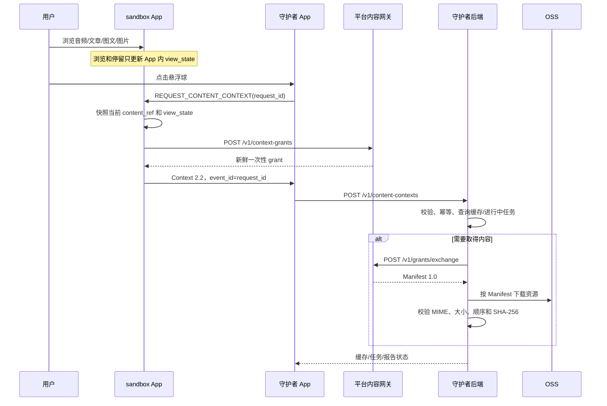

# MiMoTrust 非视频内容后端方案评审确认单

> 文档状态：待守护者后端评审
> 提交日期：2026-08-02
> 评审对象：守护者后端、内容接入层、存储与安全负责人
> 评审范围：`audio`、`article`、`rich_article`、`image_gallery`
> 当前实施事实：线上 Debug 运行时 registry 已通过开发者管理服务新增一篇纯文章；当前
> Android APK 已实现五类远程 Feed 与渲染能力，富文章、图集和音频仍等待真实内容验收

## 1. 需要后端给出的结论

请后端判断是否接受以下总体形式：

1. Android 跨 App Context 只传内容身份、用户当前查看状态和短期 grant，不传正文、图片或音频二进制；
2. 守护者 App 将合法 Context 提交守护者后端；
3. 守护者后端使用 grant 向平台内容网关兑换 Manifest 1.0；
4. Manifest 描述完整分析范围、资源顺序、URL、MIME、大小和 SHA-256；
5. 守护者后端按 Manifest 流式下载资源、校验哈希，再进入缓存或分析流程；
6. 音频、纯文章、图文文章和图片画廊共用同一 Context/Manifest 主合同，不为每种类型新建一套跨 App 协议。

后端最终请选择一个结论：

```text
[ ] 接受，可以按本文合同开发
[ ] 附条件接受，完成指定修改后可以开发
[ ] 拒绝，现有形式无法接入
```

## 2. 当前与目标状态

| 项目 | 当前状态 |
|---|---|
| 三视频沙盒 | 已实现并真机验证 |
| 阿里云 Debug 网关 | 已部署，`http://47.94.58.72` |
| Manifest Schema | 当前 `1.0` |
| Context 2.1 | 当前 APK 已实现，只支持 `comment/share` 发送路径 |
| Context 2.2 | 目标合同已批准，Schema、样例和代码尚未迁移 |
| 非视频 Context 样例 | 已有 2.1 样例 |
| 非视频 Manifest/registry | `article-001/v1` 已发布；其余类型等待真实内容 |
| 非视频 Flutter 渲染 | 五类模型和渲染器已实现；文章已接入远程 Feed |
| 守护者 App/后端 | 尚未完成联调 |

本文要求后端评审目标数据形式，不代表 Context 2.2 或非视频内容已经交付。

## 3. 目标传输流程



`comment/share` 在目标 2.2 中只发送 `deferred_grant` 候选，不触发后端提交、grant
兑换或资源下载。只有用户点击悬浮球形成的 `guardian_request` 响应进入后端。

## 4. 守护者提交给后端的统一信封

建议接口：

```http
POST /v1/content-contexts
Content-Type: application/json
Authorization: <守护者自身认证>
```

```json
{
  "request_id": "8f052041-20f1-4a38-82be-5663dad7787e",
  "guardian_app_version": "0.1.0",
  "context": {
    "schema_version": "2.2",
    "event_id": "8f052041-20f1-4a38-82be-5663dad7787e",
    "trigger": "guardian_request",
    "source_app": "mimotrust_controlled_content",
    "provider": {
      "provider_id": "mimotrust_sandbox",
      "application_id": "com.mimotrust.controlledcontent"
    },
    "content_ref": {
      "content_type": "article",
      "content_id": "article-001",
      "content_version": "v1",
      "content_hash": "<64位小写SHA-256>",
      "canonical_url": "https://<platform>/content/article-001"
    },
    "content_access": {
      "mode": "grant_exchange",
      "exchange_url": "https://<gateway>/v1/grants/exchange",
      "grant_code": "<一次性短期代码>",
      "audience": "mimotrust_guardian_backend",
      "expires_at": "2026-08-02T13:03:00+08:00",
      "scopes": ["manifest:read", "asset:read"]
    },
    "view_state": {
      "scroll_ratio": 0.42,
      "block_index": 0
    },
    "observed_at": "2026-08-02T13:00:00+08:00"
  }
}
```

固定约束：

- `request_id = context.event_id`；
- Context UTF-8 编码后不超过 32 KB；
- Context 不含文章正文、图片、音频、评论正文、联系人、Cookie、长期凭据或 OSS 密钥；
- `observed_at` 是设备观察时间，不是服务端信任依据；
- 后端必须重新执行 Schema、枚举、长度、范围和授权校验。

## 5. grant 兑换合同

后端请求平台网关：

```http
POST /v1/grants/exchange
Content-Type: application/json
```

```json
{
  "grant_code": "<一次性代码>",
  "audience": "mimotrust_guardian_backend",
  "content_id": "article-001",
  "content_version": "v1"
}
```

成功响应：

```json
{
  "grant_id": "<UUID>",
  "manifest": {
    "manifest_version": "1.0"
  }
}
```

grant 默认 180 秒有效，只能成功兑换一次，并绑定 audience、内容 ID、版本和 scopes。
后端必须区分 `GRANT_EXPIRED`、`GRANT_REPLAYED`、`AUDIENCE_MISMATCH`、
`CONTENT_MISMATCH` 和 `CONTENT_UNAVAILABLE`。

## 6. 四类内容结构

### 6.1 音频 `audio`

Context 查看状态：

```json
{
  "position_ms": 42000,
  "duration_ms": 180000,
  "is_playing": false
}
```

Manifest 资源建议：

```text
audio-main   role=analysis  MIME=audio/mpeg 或 audio/mp4
audio-cover  role=cover     MIME=image/jpeg 或 image/png（可选）
subtitle     role=subtitle  MIME=text/vtt（可选）
```

后端默认分析完整音频；`position_ms` 只用于定位用户当时听到的位置。

### 6.2 纯文章 `article`

Context 查看状态：

```json
{
  "scroll_ratio": 0.42,
  "block_index": 0
}
```

Manifest 使用 `body_asset_id` 指向唯一 UTF-8 正文资源：

```json
{
  "content": {
    "content_type": "article",
    "body_asset_id": "article-body"
  },
  "assets": [
    {
      "asset_id": "article-body",
      "role": "analysis",
      "mime_type": "text/plain; charset=utf-8",
      "source_url": "https://<OSS>/article-001/v1/body.txt",
      "sha256": "<正文文件哈希>",
      "size_bytes": 16234,
      "derivation": "original"
    }
  ]
}
```

正文不放进 Context；后端兑换 Manifest 后下载正文文件。

### 6.3 图文文章 `rich_article`

Context 同样使用 `scroll_ratio` 和 `block_index`。Manifest 使用有序块：

```json
{
  "blocks": [
    {"block_index": 0, "block_type": "text", "text": "第一段正文"},
    {"block_index": 1, "block_type": "image", "asset_id": "image-001"},
    {"block_index": 2, "block_type": "text", "text": "第二段正文"}
  ]
}
```

图片在 `assets` 中提供独立 URL、MIME、大小和 SHA-256。后端必须保持块顺序，不能只
分析文本，也不能把图文内容简化成一张长截图。

### 6.4 图片画廊 `image_gallery`

单图和多图共用该类型：

```json
{
  "view_state": {
    "active_asset_index": 2,
    "asset_count": 4
  },
  "content": {
    "asset_order": ["image-001", "image-002", "image-003", "image-004"]
  }
}
```

每张图片是独立 asset，包含 `order`、MIME、尺寸、字节数、URL 和 SHA-256。后端按
`asset_order` 重建原始顺序；`active_asset_index` 只标识用户当时看到哪一张。

## 7. 后端处理要求

后端最小处理顺序：

```text
认证守护者调用方
  -> 校验 Context Schema 2.1/2.2（迁移期）
  -> 校验 event_id/request_id 幂等
  -> 根据 provider + content_id + version/hash 查询精确缓存
  -> 未命中时兑换 grant
  -> 校验 Manifest 1.0 与 Context 内容身份一致
  -> 域名白名单与重定向限制
  -> 流式下载，执行 MIME、最大字节数和 SHA-256 校验
  -> 保留文章块/图片顺序
  -> 创建或复用分析任务
```

Receiver 或守护者 App 不负责下载正文、图片和音频；所有资源读取和安全校验放在后端。

## 8. 当前合同中需要后端确认的未决项

以下内容尚未在现有 Schema 中完整冻结，必须由后端参与决定：

| 编号 | 待确认项 | 当前建议 | 后端结论 |
|---|---|---|---|
| D1 | 纯文章 `content_hash` | 等于正文 UTF-8 文件原始字节 SHA-256，不做换行或空白归一化 |  |
| D2 | 音频 `content_hash` | 等于唯一 `analysis` 音频资源 SHA-256 |  |
| D3 | 图文/画廊整体哈希 | 对“类型 + 有序块/asset ID + 各资源哈希”的规范 JSON 做 SHA-256 |  |
| D4 | 规范 JSON 算法 | 建议采用 RFC 8785 JSON Canonicalization Scheme，避免各语言序列化差异 |  |
| D5 | 富文本表示 | 当前只允许 `text/image` 块；不直接传任意 HTML |  |
| D6 | 文章正文位置 | Manifest 引用 UTF-8 asset，不把全文内联进 Context |  |
| D7 | 图片顺序 | `asset_order` 为权威顺序，`order` 用于交叉校验 |  |
| D8 | 部分资源失败 | 任一分析必需资源缺失或哈希失败时返回 `content_unavailable`，不生成完整结论 |  |
| D9 | grant 过期处理 | 不由后端自行伪造续期；需要时再共同增加正式续期接口 |  |
| D10 | 缓存身份 | 使用 provider、content_id、version/hash、模型和流程版本组合键 |  |

如果后端不接受 RFC 8785，需明确提供可跨 Python/Java/Kotlin/Go 复现的替代整体哈希算法。

## 9. 容量与超时请后端填写

现有合同只固定 Context 上限为 32 KB，以下服务端限制尚待确认：

| 限制 | 后端接受值 |
|---|---|
| Manifest 最大字节数 |  |
| 单篇纯文章最大字节数 |  |
| 图文最大 block 数 |  |
| 图文/画廊最大图片数 |  |
| 单张图片最大字节数 |  |
| 图文/画廊总下载字节数 |  |
| 单条音频最大字节数 |  |
| 单条音频最大时长 |  |
| 单资源连接/读取超时 |  |
| 单个任务资源取得总超时 |  |
| 允许的 MIME 白名单 |  |
| 允许的 OSS/CDN 域名白名单 |  |

## 10. 安全与部署边界

当前 `http://47.94.58.72`、公开 OSS URL 和内存 grant 只属于 Debug 演示，不是后端生产
接入条件。正式接入前计划完成：

- HTTPS 域名和可信证书；
- 守护者到后端的正式认证与审计；
- 网关认证、限流和安全日志；
- Redis 或等价共享存储实现原子单次 grant 兑换；
- 私有 OSS，兑换后返回短期签名 URL；
- 下载域名白名单、重定向限制、字节数上限和流式哈希；
- 日志不记录完整 grant、签名 URL、正文、联系人或账号凭据。

请后端分别评价“数据结构是否可接受”和“当前 Debug 部署是否可直接接入”，不要因为
Debug 环境尚未生产化而忽略对数据合同本身的评审。

## 11. 后端评审清单

| 评审问题 | 接受 | 附条件 | 拒绝 | 备注 |
|---|:---:|:---:|:---:|---|
| Context 不承载正文或媒体，只承载引用和 grant | [ ] | [ ] | [ ] |  |
| 四类内容共用 Context/Manifest 主合同 | [ ] | [ ] | [ ] |  |
| 音频使用媒体播放状态 | [ ] | [ ] | [ ] |  |
| 文章使用滚动比例和块下标 | [ ] | [ ] | [ ] |  |
| 纯文章正文作为 UTF-8 asset | [ ] | [ ] | [ ] |  |
| 图文使用有序 text/image blocks | [ ] | [ ] | [ ] |  |
| 单图和多图统一为 image_gallery | [ ] | [ ] | [ ] |  |
| 后端负责 grant 兑换和资源下载 | [ ] | [ ] | [ ] |  |
| 后端负责 MIME、大小和 SHA-256 校验 | [ ] | [ ] | [ ] |  |
| 使用建议的复合内容哈希规则 | [ ] | [ ] | [ ] |  |
| 使用建议的缓存身份组合键 | [ ] | [ ] | [ ] |  |
| 支持迁移期 Context 2.1/2.2 双读 | [ ] | [ ] | [ ] |  |

## 12. 后端回复模板

```text
评审结论：接受 / 附条件接受 / 拒绝
评审人：
评审日期：
计划接入语言/框架：

可直接接受的部分：
1.

必须修改的部分：
1.

阻塞开发的问题：
1.

建议的容量与超时：
1.

建议的复合内容哈希算法：
1.

后端接口地址、认证方式和负责人：
1.
```

## 13. 评审通过标准

只有在以下条件满足后，非视频内容合同才可进入实现：

1. 后端明确接受或附条件接受第 1 节总体形式；
2. D1-D10 均有明确结论；
3. 第 9 节容量、超时、MIME 和域名限制已填写；
4. 后端提交接口、认证方式、负责人和错误码已确定；
5. Schema、正反样例、沙盒、守护者、网关和后端测试同步更新。

未经后端书面确认，不把本文中的哈希建议、容量上限或生产部署方式视为已冻结合同。
