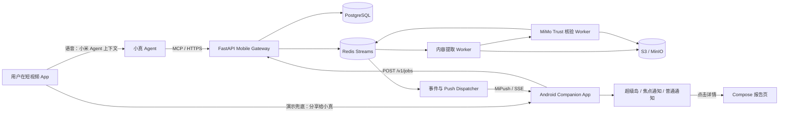

# MiMo Trust App 后端与小米真机演示技术方案

> 目标：用户在短视频场景中发起一次核验后，继续留在原应用刷视频；“小真”在后台执行 MiMo Trust，并通过 Xiaomi HyperOS 3 小米超级岛持续展示核验阶段、耗时和最终证据卡片。

## 1. 先给结论

本项目不需要重写已经验证的核验算法，而应在现有 FastAPI/Python 流水线外增加三层：

1. **Android 场景入口层**：接收当前视频的分享链接，或承接小米 Agent/小爱侧传入的当前场景上下文；
2. **异步任务与事件层**：把现有同步 `/api/analyze` 改造成可恢复的后台 Job，并实时产生阶段事件；
3. **HyperOS 展示层**：使用同一个通知 ID 更新超级岛/焦点通知，任务结束后切换为结论卡片。

推荐采用“官方体验路径 + 可控演示路径”并行：

- **目标路径**：小米 Agent 生态中的“小真”负责语音唤起和当前场景授权，通过 MCP/HTTPS 调用 MiMo Trust；
- **演示兜底路径**：在抖音、快手、小红书等分享面板点击“小真核验”，透明 Activity 收到 URL 后立刻结束并返回视频。用户只离开约一次点击，不进入 MiMo Trust 主界面；
- **不采用**：用无障碍服务自动点击短视频应用、偷读剪贴板，或让普通 APK 永久在线监听麦克风。这些方案不稳定、难过审且隐私风险高。

## 2. 关键技术边界

### 2.1 “小真”唤醒

普通 Android App 不能与系统语音助手等价地常驻监听自定义唤醒词。`VoiceInteractionService` 只有被用户/系统选为全局语音交互服务后才具备系统支持的后台热词能力；国行小米真机上能否替换默认助手也不能作为比赛演示的前提。

因此推荐顺序为：

1. 在小米澎湃 OS Agent 生态创建“小真”Agent；
2. Agent 通过远程 MCP 工具 `verify_current_content` 调用本项目；
3. 与小米确认 Agent 是否能取得“当前应用内容 URL/分享对象”的经授权上下文；
4. 若该上下文接口尚未开放，演示时改用 Android Sharesheet 的“小真核验”入口，不宣称完全无感获取当前视频。

不建议为了口播效果在 App 内做持续麦克风监听。Android 12+ 限制后台启动前台服务，Android 14+ 对后台启动 microphone 类型前台服务进一步执行即时权限检查；即使技术上通过可见 Activity 启动，也会出现麦克风隐私提示、耗电和审核问题。

### 2.2 “当前视频”获取

公开 Android API 没有跨 App 查询“当前视频 URL”的统一接口。可靠性从高到低为：

1. 短视频平台通过 `ACTION_SEND` 分享文本/URL 给小真；
2. 小米系统 Agent 在用户授权后提供当前场景 URL、分享对象或结构化上下文；
3. 用户主动提供截图/录屏；
4. 无障碍自动化或剪贴板监听（不进入正式方案）。

比赛真机演示应锁定已在现有后端验证过的公开 URL，并提前验证对应平台分享文案格式、账号会话和网络出口。

### 2.3 超级岛不是普通通知自动升级

Xiaomi HyperOS 3 的超级岛使用焦点通知同一套扩展数据接口，但需要应用包名、通知 channel 和场景方案通过小米侧权限申请。HyperOS 2 只能展示焦点通知形态，HyperOS 3 才支持岛。

因此必须同时准备：

- HyperOS 3 真机 + 已开通焦点通知权限的正式包名；
- 同一个 APK 的普通 Android 进度通知 fallback；
- 服务端/客户端按系统的 `notification_focus_protocol` 和 `canShowFocus` 查询结果选择模板；
- 未获白名单时，不承诺现场一定“上岛”，但整个业务仍能用普通通知完成。

## 3. 推荐技术栈

| 层 | 技术选择 | 作用 |
|---|---|---|
| Android App | Kotlin + Jetpack Compose | 分享入口、任务列表、报告详情和设置 |
| Android 网络 | Retrofit + OkHttp/SSE | 创建任务、前台接收实时事件 |
| Android 本地 | Room/SQLite、DataStore、Keystore | 保存任务摘要、普通设置和安全令牌 |
| 系统适配层 | Kotlin interface + vendor adapter | ACTION_SEND、MiPush、超级岛和系统能力查询 |
| 后台唤回 | MiPush | App 被系统回收后继续接收阶段更新和最终结果 |
| 系统展示 | Android Notification + `miui.focus.param` | HyperOS 3 超级岛、OS2 焦点通知及普通通知降级 |
| API 网关 | 保留 FastAPI + Pydantic | 移动端 API、鉴权、限流、SSE 和报告读取 |
| 异步任务 | Redis Streams + ARQ（Python async worker） | 任务队列、重试、阶段事件和取消标记 |
| 元数据 | PostgreSQL | Job、用户设备、幂等键、状态和结果索引 |
| 大文件/审计产物 | S3/MinIO | 原始媒体、关键帧、JSON、Markdown 报告和审计文件 |
| 核验核心 | 复用现有 MiMo V2.5、MiMo ASR、Exa/OpenAlex/ArXiv/Wikipedia/Semantic Scholar | 内容理解、检索、证据筛选和报告 |
| 平台解析 | 独立 Playwright/yt-dlp 适配 Worker | 隔离浏览器 Cookie、CPU/IO 和平台风控故障 |
| 可观测性 | OpenTelemetry、Prometheus、Grafana、Sentry | Job 级耗时、失败率、平台解析成功率和错误追踪 |
| 部署 | Docker Compose（演示）→ Kubernetes（生产） | 演示简单可控，后续按 Worker 类型扩容 |

为什么演示阶段选择 ARQ 而不是直接在 FastAPI 中 `create_task`：进程重启后任务不能丢，且现有代码大量使用 `async/await`，ARQ 与当前代码改造成本较低。后续若出现跨小时工作流、人工复核、复杂补偿和多集群，可将编排层升级为 Temporal；比赛阶段不应先引入该复杂度。

## 4. 端到端架构



### 4.1 为什么移动端不直接调用当前 `/api/analyze`

现有接口会在一个 HTTP 请求内依次完成提取与核验；连接断开、App 退后台或服务重启时，客户端不知道任务是否仍在执行。现有 `verify_structured_information` 还通过进程级锁串行核验，因为下游计时保存在全局变量中。这适合单机 Demo，不适合多手机后台任务。

改造目标是：HTTP 只负责“创建/查询任务”，真实工作由可恢复 Worker 执行，并且每一阶段提交事件。

## 5. Mobile API 设计

### 5.1 创建任务

`POST /v1/jobs`

```json
{
  "source": {
    "type": "shared_url",
    "value": "https://v.douyin.com/...",
    "platform_hint": "douyin"
  },
  "mode": "auto",
  "client_request_id": "device-generated-uuid"
}
```

立即返回 `202 Accepted`：

```json
{
  "job_id": "01J...",
  "status": "queued",
  "created_at": "2026-08-01T10:00:00+08:00",
  "event_url": "/v1/jobs/01J.../events"
}
```

`client_request_id + 用户/设备 ID` 作为幂等键，避免用户重复说话或重复点击后创建两份核验。

### 5.2 状态、事件与结果

- `GET /v1/jobs/{job_id}`：当前状态和最新阶段；
- `GET /v1/jobs/{job_id}/events`：SSE，调试和 App 在前台时使用；
- `GET /v1/jobs/{job_id}/result`：最终精简卡片数据和完整报告入口；
- `POST /v1/jobs/{job_id}/cancel`：尽力取消尚未进入不可中断调用的阶段；
- `DELETE /v1/jobs/{job_id}/source`：按用户请求删除原始输入材料。

阶段事件统一协议：

```json
{
  "event_id": "01J...",
  "job_id": "01J...",
  "sequence": 4,
  "stage": "evidence_retrieval",
  "state": "running",
  "display_text": "正在比对公开来源",
  "elapsed_ms": 18320,
  "progress_hint": 55,
  "occurred_at": "2026-08-01T10:00:18+08:00"
}
```

`progress_hint` 只是步骤进度，不应表达“真实性概率”，也不建议向用户显示模型内部推理过程。

## 6. Job 状态机与超级岛映射

| 后端阶段 | 岛摘要态 | 展开态/通知卡片 | 更新策略 |
|---|---|---|---|
| `queued` | 小真已接收 | 等待开始核验 | 首次可自动展开一次 |
| `content_resolving` | 正在读取视频 | 已识别平台，获取公开内容 | 静默更新，不反复展开 |
| `media_extracting` | 正在理解内容 | 字幕/语音/画面提取中 · 已用时 12 秒 | 5–10 秒节流更新 |
| `claim_structuring` | 已识别关键主张 | 识别到 N 条待核验主张 | 阶段切换时更新 |
| `evidence_retrieval` | 正在查找来源 | 多源检索中 · 已查看 N 条 | 仅显著节点更新 |
| `evidence_triage` | 正在比对证据 | 核对来源身份、时间与直接性 | 静默更新 |
| `report_generating` | 即将完成 | 正在汇总结论与不确定项 | 静默更新 |
| `completed` | 存在关键差异 / 证据支持 / 暂缺证据 | 结论、2 条关键依据、来源数、总耗时、“查看证据” | 自动展开一次，之后保留通知卡片 |
| `failed` | 本次未完成 | 简短可理解原因 + 重试 | 不暴露技术堆栈 |

注意：超级岛的百分比应表示“流程完成度”，不能命名为“可信度 76%”。最终结论沿用当前项目已有的“属实、部分属实、误导、虚假、待核实、缺乏证据”等证据状态，并在卡片上优先使用更中性的用户文案。

### 6.1 通知更新规则

- 一个 Job 固定一个 `notificationId`，持续更新而不是创建多条通知；
- MiPush 更新带单调递增 `sequence`，防止网络乱序让进度倒退；
- `updatable=true`；中间阶段 `enableFloat=false`，避免用户刷视频时频繁弹出；
- 创建任务和最终结果可各自动展开一次；
- 完成后岛摘要态按方案主动消失，通知卡片保留一段有限时间；
- 未获得焦点通知权限、系统不是 HyperOS 3 或用户关闭通知时，自动退化为普通 Android 通知和 App 内任务列表。

## 7. Android App 模块划分

```text
android/app/src/main/java/com/mimotrust/xiaozhen/
  data/                   # Retrofit/OkHttp、Room 和 JobRepository
  share/                  # 透明 ACTION_SEND Activity、WorkManager
  notification/           # 普通通知及小米焦点通知适配边界
  integration/            # 小米 Agent / 自有短视频平台接口
  ui/                     # Compose 首页、任务卡片、分析时间线和详情
```

`notification` 和 `integration` 是唯一允许依赖小米专有能力的模块。Compose 业务层只消费 `JobEntity`，不能到处拼接 `miui.focus.param` JSON。未获权限或非小米手机统一降级到普通通知。

App 声明接收 `ACTION_SEND text/plain`，从 `Intent.EXTRA_TEXT` 取出分享文案。透明入口 Activity 不渲染 Compose 首帧：只向 WorkManager 投递任务并立即 `finish()` 返回短视频 App，避免冷启动页面破坏返回体验。

MiPush 接收、超级岛更新和最终通知点击在 Kotlin 原生侧完成，不能依赖 Compose 页面存活。App 前台用 SSE；进程被回收后，由未来接入的 MiPush Receiver 根据单调递增 `sequence` 更新同一个通知 ID，并用 Deep Link 恢复详情。

## 8. 现有后端改造清单

### P0：真机闭环必须完成

1. 新增 `Job`、`JobEvent`、`JobResult` 数据模型和 `/v1/jobs` API；
2. 将内容提取和信源核验拆为 Worker 任务；
3. 为现有每个阶段加入事件回调，不依赖读取最终 `05_timings.json` 才知道耗时；
4. 把 `LLM_CALL_TIMINGS` 从进程全局变量改为 run-local context，删除全局 `_verification_lock`；
5. Redis Stream 持久化事件，SSE 只作为读取视图；
6. 新增 MiPush dispatcher 和同一通知 ID 的顺序更新；
7. 最终结果生成专用 Mobile Card DTO，避免 App 直接解析庞大内部报告；
8. Docker Compose 增加 PostgreSQL、Redis、MinIO、API、extract-worker、verify-worker。

### P1：提高现场稳定性

1. 对演示 URL 预热缓存，并保留“强制实时核验”开关；
2. 平台解析 Worker 与核验 Worker 分池，抖音验证失败不拖垮其他任务；
3. 增加每阶段超时、指数退避、最大重试次数和可理解的错误码；
4. 报告和来源链接做域名白名单、安全跳转和内容留存策略；
5. 加入离线演示数据包，仅在现场网络完全不可用时明确标注“演示缓存结果”。

## 9. 小米真机选择与申请

### 9.1 设备要求

- 选择明确运行 **Xiaomi HyperOS 3** 的国行小米手机；
- 开发前读取 `notification_focus_protocol`，现场确认返回 `3`；
- 安装正式签名、固定包名 APK，不能临时换 applicationId；
- 关闭该 App 的省电限制，允许自启动和通知；
- 使用同一台主展示机完成全流程彩排，备用机安装相同版本。

不要只按机型名称判断是否支持超级岛；官方说明以系统版本为主。

### 9.2 需要尽快申请的两项能力

1. **焦点通知/超级岛权限**：准备包名、AppId、channel、公司/团队主体、场景说明、所有通知节点、大小岛与展开态设计、展示和消失时机；
2. **小米 Agent 生态测试资格**：创建“小真”Agent，接入 MiMo Trust 的远程 MCP，使用云真机和 Miclaw 手机端调试。

超级岛场景应强调：由用户主动发起、服务生命周期明确、核验结束即终止、无营销属性、用户希望在不离开视频的情况下持续查看进度。这与官方“用户主动发起、有限生命周期、持续服务进展”准入原则高度一致。

## 10. 演示脚本

### 方案 A：拿到小米当前场景能力后的理想演示

1. 在抖音打开预先验证的视频；
2. 唤起“小真”，说“核验一下这个视频可信不可信”；
3. 小真获取用户授权的当前内容引用，调用 `verify_current_content`；
4. 用户继续向下刷视频；
5. 超级岛依次显示“读取内容 → 识别主张 → 查找来源 → 比对证据”和累计时间；
6. 完成时岛自动展开，显示中性结论、来源数和总耗时；
7. 点击卡片进入完整证据页，展示逐主张结论和可点击来源。

### 方案 B：只依赖已公开能力的稳妥演示

1. 在抖音点击分享，选择“小真核验”；
2. 透明入口立即返回抖音并发起 Job；
3. 用户继续刷视频，后续超级岛流程与方案 A 完全相同；
4. 主持人口径应说“分享给小真后后台核验”，不要声称 App 自动读取了其他应用内容。

### 演示验收指标

- 分享到返回短视频页面：目标小于 1 秒；
- 创建 Job 到首次岛状态：目标小于 2 秒；
- 阶段事件不倒退、不重复弹出；
- App 被划走后仍能收到最终卡片；
- 相同视频重复核验命中缓存时快速返回，并明确标注核验时间；
- 断网、平台解析失败、MiMo 超时均有可理解的失败卡片；
- 最终卡片点击后能打开完整证据，不只显示单一真假标签。

## 11. 安全与合规

- 只处理用户主动分享或系统明确授权的当前内容；
- URL 必须经过现有 SSRF/重定向安全校验；
- 手机与 API 之间使用短期 access token，设备密钥放 Android Keystore；
- 原始媒体默认短期保存，报告与来源可配置更长保留，用户可删除；
- 日志不记录 Cookie、token、完整个人分享文案和私密内容；
- 平台浏览器 Cookie 只存在隔离的低权限解析 Worker；
- 卡片标注“AI 辅助核验”，高风险领域展示“仅供信息参考”；
- 保存可审计阶段、工具状态和证据依据，但不展示模型原始思维链。

## 12. 建议实施顺序

### 第 1 周：后端任务化

完成 Job API、Redis Stream、Worker 拆分、阶段事件、Docker Compose 和一个 curl/SSE 端到端用例。

### 第 2 周：Android 可靠入口

完成 Kotlin/Compose 工程、分享接收、任务列表、普通进度通知和报告详情；先在任意 Android 真机跑通，不等待超级岛权限。

### 第 3 周：HyperOS 适配

接入 OS3 岛模板、OS2 焦点通知降级、MiPush 更新和真机稳定性测试，同时提交焦点通知场景方案。

### 第 4 周：Agent 与彩排

接入“小真”Agent/MCP；如果当前场景上下文能力没有落实，立即冻结为“分享入口 + 超级岛”演示，不再投入无障碍自动化。完成缓存预热、弱网和失败兜底、主备手机彩排。

## 13. 当前阶段的最终技术决策

1. **后端继续使用 Python/FastAPI，不迁移语言**；
2. **核验流水线改为异步 Job，不在手机 HTTP 长连接里直接执行**；
3. **Redis Streams + ARQ 承接比赛阶段任务与事件，PostgreSQL 保存事实状态**；
4. **移动端采用 Kotlin + Jetpack Compose + Room + Retrofit/OkHttp，分享接收是必做入口**；
5. **超级岛同时支持客户端本地通知和 MiPush 服务端更新，普通通知永远保留**；
6. **语音入口优先走小米 Agent 生态，不自研长期唤醒服务**；
7. **“无感取得当前视频”作为小米系统合作依赖，不用无障碍方案伪装成正式能力**。

## 14. 官方资料

- [小米超级岛业务介绍](https://dev.mi.com/xiaomihyperos/documentation/detail?pId=2140)
- [小米超级岛开发指南](https://dev.mi.com/xiaomihyperos/documentation/detail?pId=2131)
- [小米超级岛方案提报说明](https://dev.mi.com/xiaomihyperos/documentation/detail?pId=2144)
- [小米超级岛常见 Q&A](https://dev.mi.com/xiaomihyperos/documentation/detail?pId=2146)
- [小米 Agent 应用发布操作指南](https://dev.mi.com/xiaomihyperos/documentation/detail?pId=2305)
- [Android VoiceInteractionService](https://developer.android.com/reference/android/service/voice/VoiceInteractionService)
- [Android 后台启动前台服务限制](https://developer.android.com/develop/background-work/services/fgs/restrictions-bg-start)
- [Android 接收其他 App 分享内容](https://developer.android.com/training/sharing/receive)
