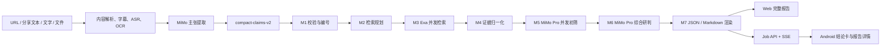

# 后端核验服务

> 入口：`app/main.py`
> 模块化流水线：`app/trust/pipeline_v2/`
> 详细协议规范见 `docs/模块化核验流水线升级说明.md`

---

## 总体架构



---

## M1-M7 模块化流水线

### M1 输入规范化

- 严格校验上游紧凑主张 JSON（`compact-claims-v2`）
- 为主张分配稳定编号 `C1`、`C2`、…
- 去重、字段类型校验、长度约束

### M2 检索规划

- MiMo 为每条主张定义核验需求、证据门槛和查询
- 生成精确查询、实体查询、第一手来源查询和反向查询
- 保存模型原始输入、输出、指标及验证后的计划

### M3 并发检索

- 全部查询同时发送给 Exa
- 每项任务独立限时，单项超时或失败不阻塞其他
- 学术、官方、法规、媒体等渠道意图由 Exa 查询覆盖

### M4 证据归一化

- 纯程序解析、清洗、去重
- 建立统一证据池
- 不机械判定来源可信或事实真假

### M5 证据初筛

- MiMo Pro 将证据池分块并发处理
- 输出每条证据与各主张的关系、直接性和可用性
- 不静默丢弃候选

### M6 综合研判

- MiMo Pro 结合全部初筛账本，逐主张交叉核验
- 识别循环引用、证据缺口、限定词差异和叙事引导
- 非法或不完整 JSON 会复用现有证据自动重试

### M7 报告渲染

- 纯程序验证并渲染完整 JSON/Markdown
- 展示综合结论、逐项依据、叙事分析、待补证据、关键来源、耗时与用量

---

## 核验档位

| 档位 | M2 | M5/M6 | M6 思考 | 适用场景 |
|------|-----|-------|---------|---------|
| `speed` | MiMo 2.5 | MiMo 2.5 Pro | 关闭 | 短视频快速风险粗筛 |
| `quality` | MiMo 2.5 | MiMo 2.5 Pro | 开启 | 复杂、歧义更高的案例 |

两档使用相同查询和证据，只改变最终研判的思考强度。

---

## 内容提取

### 平台解析器

| 平台 | 解析方式 |
|------|---------|
| 抖音 | Playwright 浏览器 → 拦截 `aweme/detail` API |
| 快手 | 专用页面适配器 `app/kuaishou.py` |
| 微博 | 专用页面适配器 `app/weibo.py` |
| 小红书 | 解析 `__INITIAL_STATE__` JSON |
| B站 | yt-dlp 提取 |
| 视频号 | 专用适配器 `app/channels.py` |
| YouTube | yt-dlp 提取 |

### 自适应处理

1. 从分享文案抽取 URL，逐跳安全展开短链
2. 区分视频和图文轮播
3. 优先使用完整平台字幕；无字幕时执行分段 ASR
4. 字幕/ASR 获得有效文本后短路，不下载视觉轨
5. 只有无有效口播文本时才提取关键帧并 OCR
6. 合并发布上下文、完整语音、OCR 和画面信息
7. 通过严格 JSON Schema 转换为下游标准数据

---

## Job 系统

### 模式

| 模式 | 说明 | 依赖 |
|------|------|------|
| `memory` | 内存存储，开发/演示用 | 无 |
| `distributed` | PostgreSQL + Redis + ARQ | docker-compose |

### 任务生命周期

```
queued → content_resolving → media_extracting → claim_structuring
→ evidence_retrieval → evidence_triage → report_generating
→ completed / failed / cancelled
```

### 受控内容集成

后端提供 `/v1/controlled-content/exchange` 端点，代替 App 向内容网关兑换 grant：

1. App 发送 `exchange_url` + `grant_code` + `content_id` + `content_version`
2. 后端代理请求内容网关
3. 校验 Manifest 中的分析资产和 SHA-256
4. 返回视频 URL 给 App 创建核验任务

---

## 安全设计

- SSRF 防护：URL 解析到内网地址时拒绝访问
- 平台白名单：只允许已知平台域名
- 外部网页：移除脚本和可疑指令，封装为纯数据片段
- 数据最小化：只处理用户主动授权的单条内容

---

## 配置

所有下游模型、超时、token、查询数、Exa 结果数和批次大小都可在 `.env` 配置。

完整清单见 `.env.example`，关键配置：

| 变量 | 说明 |
|------|------|
| `MIMO_API_KEY` | MiMo API 密钥 |
| `EXA_API_KEY` | Exa 搜索 API 密钥 |
| `MIMO_JOB_MODE` | `memory` / `distributed` |
| `MIMO_PLANNING_MODEL` | M2 使用的模型 |
| `MIMO_TRIAGE_MODEL` | M5 使用的模型 |
| `MIMO_REPORT_MODEL` | M6/M7 使用的模型 |
