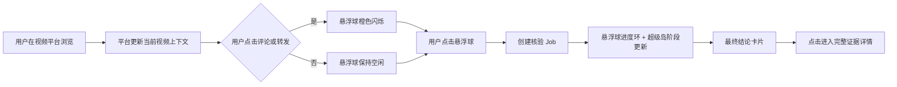

# 小真悬浮球与超级岛交互设计

## 用户流程



用户在“设置 → 悬浮核验球”中主动开启功能。首次开启会进入 Android 的“显示在其他应用上层”授权页；关闭开关会立即移除悬浮球并停止前台服务。

## 悬浮球状态

| 状态 | 视觉 | 触发条件 | 点击行为 |
|---|---|---|---|
| `Idle` | 小真头像、低对比外环 | 已开启，当前没有任务 | 核实最新的有效视频上下文 |
| `Attention` | 橙色完整外环，约 820ms 呼吸闪烁 | 用户点击评论或转发 | 发起核验 |
| `Queued` | 橙色短进度弧 | Job 已创建 | 打开任务详情 |
| `Resolving` | 橙色进度环 | 读取视频、提取内容 | 打开任务详情 |
| `Searching` | 橙色进度环 | 检索并比对证据 | 打开任务详情 |
| `Finishing` | 接近完整的进度环 | 汇总结论 | 打开任务详情 |
| `Completed` | 绿色完整外环，4 秒后恢复空闲 | 核验完成 | 打开结果详情 |
| `Failed` | 橙色完整外环，4 秒后恢复空闲 | 解析或核验失败 | 打开失败详情 |

悬浮球可以拖动，使用 `TYPE_APPLICATION_OVERLAY`，并由用户主动开启的 `specialUse` 前台服务维持。服务常驻通知使用低重要性、静默 Channel。

## 当前视频上下文接口

公开 Android API 不能读取另一个 App 当前播放的视频 URL，也不能可靠知道第三方 App 的评论/转发点击。正式方案只接受两种来源：

1. 自有视频平台或同签名合作 App 主动注入；
2. 获得授权后的小米场景/Agent 能力，通过同一接口适配。

自有视频平台与小真使用相同签名时，可发送受签名权限保护的显式广播：

```kotlin
val intent = Intent("com.mimotrust.xiaozhen.action.UPDATE_VIDEO_CONTEXT").apply {
    setPackage("com.mimotrust.xiaozhen")
    putExtra("video_url", currentVideoUrl)
    putExtra("interaction", "comment") // view / comment / share
}
sendBroadcast(intent)
```

`comment` 和 `share` 会触发提示闪烁；`view` 只更新 URL。上下文有效期为 90 秒，避免用户快速切换视频后误核验上一条内容。若没有新鲜上下文，点击悬浮球只显示“请先从视频平台分享给小真”，不会读取剪贴板或启用无障碍监听。

## 超级岛映射

Android Job 的同一个 `jobId.hashCode()` 持续更新同一条通知：

| Job 阶段 | 超级岛标题 |
|---|---|
| 排队 / 初始解析 | 正在读取视频 |
| 主张结构化 | 正在识别关键主张 |
| 证据检索与筛选 | 正在查找并比对来源 |
| 报告生成 | 即将完成 |
| 完成 | 后端返回的中性 verdict 与结论 |
| 失败 | 本次未完成 |

适配器读取 `notification_focus_protocol`，仅协议版本不低于 3、制造商为 Xiaomi，且 `canShowFocus` 确认当前包名已有焦点通知权限时，才附加 `miui.focus.param` 和 `miui.focus.pics`。其他情况自动使用标准 Android 进度通知和 BigText 结果卡片。

正式发布前，`content_verification` 业务场景码、包名、签名、通知 Channel 和所有节点文案必须与小米审批结果一致。
