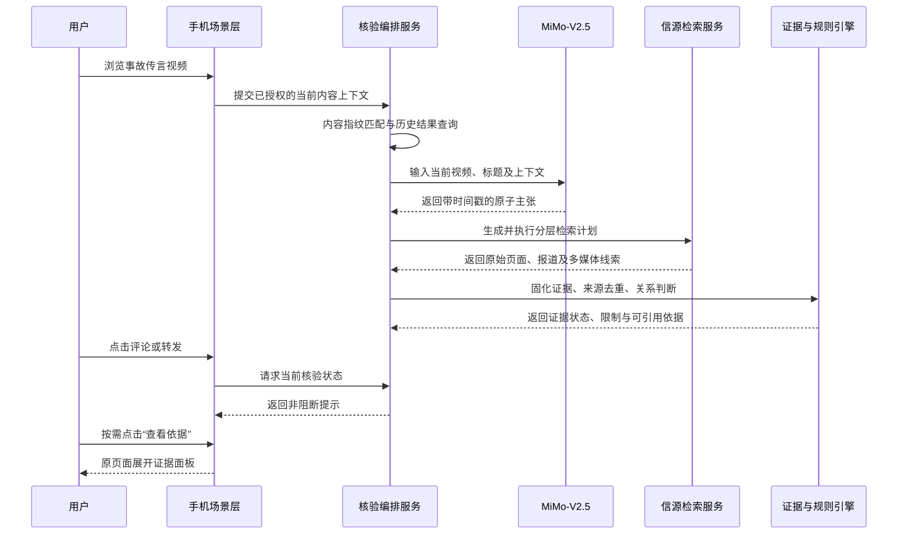
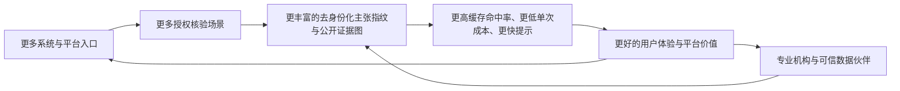

# 信源守护者（MiMo Trust）作品规划书

> **作品类型**：基于 Xiaomi MiMo-V2.5 的多模态信源核验与传播提示工具<br>
> **参赛赛道**：Xiaomi MiMo 竞赛单元<br>
> **参赛组别**：高校赛区<br>
> **核心主张**：无需离开当前页面，让来源与证据在传播前自然到达。

---

## 项目核心速览

> **核心痛点**：浏览内容时，核验不是用户的主要任务。退出页面、复制链接、上传文件或重新搜索中的任一步，都可能让核验行为不再发生。<br>
> **核心方案**：经用户授权，系统在当前场景获取正在浏览的内容并在后台完成分析；评论或转发时提供醒目但可忽略的提示，浏览时可通过侧边栏或小爱一句话唤出，结果直接回到原页面展示。<br>
> **核心技术**：MiMo-V2.5 全模态内容理解 + 原子主张拆分 + 信源传播图 + 证据约束结论。<br>
> **核心原则**：不拦截、不说教、不替用户判断；所有提示均可展开到来源、原文和不确定项。

**核心闭环：当前内容上下文 → 自动理解与检索 → 场景内轻提示 → 按需展开证据 → 用户自主评论或转发。**

---

## 一、项目摘要

> **本节重点：信源守护者不是等待用户提交材料的核验工具，而是一项主动靠近浏览与传播场景的信息可信辅助能力。**

### 1.1 项目引子：答案只有一步之遥，核验仍然没有发生

2026 年 7 月，围绕小米新产品系列 SkyNomad 澎程，网络上已经出现“起火”“车祸”“车主维权”等联想词和疑似 AI 生成的事故内容。当时该车型尚处于上市筹备阶段、暂无量产交付车辆，报道援引的小米汽车工作人员也否认存在相关真实事故和车主维权案例。

一边是“真实车主已经出事故”的短视频，另一边是“尚无量产交付车辆”的基本时间线。尚未交付的车型却已经出现“真实车主事故”，荒谬之处并不难发现；但相关内容仍能进入搜索联想、被当作真实事件讨论并继续传播。答案甚至只隔着一次搜索，可事故画面、数字人口播和情绪化标题已经在当前页面形成了完整叙事；要求用户退出视频、组织关键词、寻找产品状态、辨别转载来源，再回到原页面作出判断，仍然是一条很少有人愿意主动走完的路径。

> **这一事件揭示了项目真正要解决的问题：不是互联网上没有答案，而是答案没有在用户相信、评论和转发之前自然到达。荒谬本身不会阻止传播，降低核验成本才有可能。**

### 1.2 方案摘要

短视频、截图、聊天记录和片段化文字降低了信息生产与传播的门槛，也让来源丢失、语境缺失、旧闻新炒和情绪化暗示更难被普通用户识别。现有事实核查通常要求用户离开当前应用、提炼关键词、主动搜索并自行比较多个来源，这对中老年人、青少年以及缺乏检索经验的用户并不友好。

“信源守护者”是一项以 Xiaomi MiMo-V2.5 为多模态理解和语义分析核心的信源核验能力。用户首次授权后，系统围绕当前正在浏览的内容工作：进入评论或转发环节时，后台分析结果以非打断式提示出现；浏览过程中，用户也可通过侧边栏或小爱一句话唤起，程序自行获取当前视频、图片或页面上下文，无需复制、上传或切换页面。当前检测范围覆盖文章 URL，以及快手、微博、小红书、视频号、抖音、哔哩哔哩和 YouTube 等公开内容；同时支持用户把文字、图片、音频、视频手动组合成一个核验案例。平台分享、文件上传和文本粘贴作为兼容入口保留，但不构成产品的主要体验。

系统从视频画面、语音、字幕和文字中识别可核验主张，自动追踪原始来源，分析证据与主张之间的支持、反驳或限定关系。用户先看到“证据支持”“存在关键差异”或“暂缺证据”等简明提示，按需展开后可查看原文引用、来源链接、核验时间和不确定项。简明提示降低获取结论的成本，完整证据链保证结果仍可复查。

产品不采用简单的“真/假”标签，也不阻止用户评论或转发。其核心价值是在信息传播的关键节点提供一条低门槛、可追溯、可复查的证据路径，帮助用户理解“内容说了什么、来源在哪里、哪些证据能够支持、哪些部分仍无法确认”。

---

## 二、团队介绍与分工

我们是来自 **武汉大学**的 **[真的假的]**，团队共 **3** 人。具备产品设计、人工智能开发、前后端开发和视觉设计等能力。

团队希望借助 Xiaomi MiMo-V2.5，开发“信源守护者”，帮助用户更方便地查看信息来源和相关证据。

| 成员 | 专业/年级 | 主要分工 |
|---|---|---|
| 丁凯 | 计算机科学与技术/2023 | 产品设计、项目统筹、前端开发 |
| 蔡占豪 | 软件工程/2023 | 后端开发 、平台架构          |
| 王卓 | 软件工程/2023 | 算法工程、检索与 Prompt 优化 |


比赛期间，团队将协同完成产品原型、技术实现、测试优化和现场展示。


## 三、作品主题

### 3.1 作品主题

本项目关注的不是建设另一个静态辟谣信息库，而是把多模态内容理解和可追溯证据核验带到信息传播之前。作品主题为：

> **面向短视频时代的多模态信源核验 Agent：看见来源，理解证据，自主判断。**

### 3.2 MiMo 的核心作用

MiMo 不是项目中的装饰性对话入口，而是主链路中的推理核心：

1. 融合理解视频画面、语音、字幕和标题；
2. 区分事实陈述、观点、预测、讽刺和情绪化表达；
3. 将复杂内容拆分为可检索、可比对的原子主张；
4. 根据主张类型生成中性检索计划；
5. 判断证据对主张的支持、反驳、限定或无关关系；
6. 在证据范围内生成中立、易读的核验报告。

项目通过团队自建的任务编排服务约束每一阶段的输入与输出。视频规格、结构化结果、超时重试和降级策略由服务端统一管理，保证 MiMo 调用能够稳定进入后续证据链路。

---

## 四、需求洞察

> **本章核心：信息核验的第一道门槛不是技术，而是用户在日常浏览中通常不会主动开始核验。产品必须把理解、检索和比较工作带到当前场景。**

### 4.1 核验最大的门槛，是核验行为本身不会发生

在刷视频、阅读资讯和参与讨论时，用户的主要任务是浏览和互动，而不是完成一次事实调查。即使对内容产生怀疑，退出当前页面、复制链接、上传文件、提炼关键词、等待结果和比较来源等连续操作，也会不断增加放弃成本。依赖用户手动提交的核验工具，只能服务已经具有较强核验意愿的人，难以覆盖无意识相信和传播信息的关键人群。

因此，产品体验遵循五项要求：

1. **一次授权**：用户明确授权当前内容的获取范围，不反复完成文件选择；
2. **场景内取材**：程序直接获取当前视频、图片或页面上下文，无需用户整理材料；
3. **后台完成**：内容理解、检索与证据比较由系统自行执行；
4. **原页面提示**：结果以轻提示或底部浮层返回，不要求切换页面；
5. **按需展开**：用户先低成本获得证据状态提示，需要时再查看完整证据。

### 4.2 用户面对的不是“没有信息”，而是“缺少判断路径”

用户看到一段争议内容时，通常面临四个连续障碍：

1. 不知道视频中究竟有几条可以核验的事实主张；
2. 不知道应当使用什么中性关键词搜索；
3. 无法判断十篇相似文章是否只是同一来源的转载；
4. 即使找到资料，也难以比较时间、地点、对象和条件是否一致。

因此，单纯提供一个搜索框或一个大模型回答并不能解决问题。产品必须同时降低内容理解、检索、来源比较和证据解释的门槛。

### 4.3 误导内容往往混合事实、暗示与情绪

部分内容不会直接说出一个明确错误结论，而是把真实片段、缺失条件、反问句和焦虑表达组合在一起。例如，视频可能先陈述某种农业现象，再通过“你觉得安全吗”等表达引导观众自行得出风险结论。

系统需要区分两类信息：

- **明确主张**：内容直接陈述、能够回到原视频时间段的事实命题；
- **可能暗示**：由反问、因果连接或画面组合形成的隐含含义。

隐含含义只能以“系统识别到的可能暗示”展示，不能冒充作者的明确原话。这样既保留对焦虑营销的识别能力，也降低过度解读风险。

### 4.4 最有价值的介入时机是传播之前

传统辟谣多发生在内容已经广泛传播之后。信源守护者将评论、转发和家庭沟通之前作为核心提示节点：系统在后台完成当前内容分析，用户可以忽略提示继续操作，也可以原地展开来源与证据。产品由此从“事后纠错”转向“传播前辅助判断”，同时避免强制确认和内容拦截。

### 4.5 目标用户

| 用户群体 | 主要困难 | 产品价值 |
|---|---|---|
| 中老年用户 | 不熟悉关键词检索和多来源比较 | 大字号、语音解释、一步核验 |
| 青少年用户 | 容易受短视频标题、剪辑和群体情绪影响 | 展示原始主张、来源与上下文 |
| 普通内容消费者 | 没有时间完成完整检索 | 自动整理证据，保留原文链接 |
| 家庭成员 | 面对争议内容时沟通成本高 | 分享中立核验卡片，减少对抗性表达 |
| 内容与系统平台 | 需要更透明、非阻断的可信提示 | 可解释的证据能力，而非单一标签 |

---

## 五、产品定位与设计原则

### 5.1 产品定位

信源守护者是一项“信息可信辅助能力”，不是内容审查工具、自动裁决机构或医疗、法律、食品安全鉴定服务。

### 5.2 五项设计原则

1. **提醒而不拦截**：提示醒目但可忽略，不禁止评论和转发。
2. **帮助而不裁决**：描述现有证据，不使用指责、羞辱或说教口吻。
3. **证据先于结论**：每个结论必须关联已保存、可定位的证据。
4. **明确表达不确定性**：找不到充分证据时返回“暂无法确认”。
5. **授权最小化**：只处理用户主动提交或明确授权的当前内容，并说明保存期限。

### 5.3 产品边界

- 不持续读取用户屏幕、评论输入或私人聊天；
- 不把“搜索不到”解释为“内容虚假”；
- 不将模型内部知识直接当作核验证据；
- 不展示模型的原始思维链，只展示可审计的任务步骤、工具状态和证据依据；
- 不用无法解释的百分比表示“真实概率”；
- 高风险领域只提供来源与信息辅助，不替代专业机构判断。

---

## 六、核心场景与用户体验

> **本章核心：用户不需要整理或提交材料。系统在当前浏览场景获取内容、后台完成核验，并把简明结果送回评论、转发或浏览页面。**

### 6.1 评论与转发节点提示

用户开启信息提示并授权当前场景后，内容进入前台时先执行指纹匹配；在停留浏览期间，系统可对当前单条内容进行后台预分析，不记录连续浏览历史。评论或转发动作只提升该任务优先级并读取当前证据状态，在操作区域附近显示醒目但不遮挡的提示。

提示采用“快速命中 + 完整核验”双通道：系统先使用内容哈希、关键帧指纹和规范化主张匹配已有核验结果，命中时即时返回；未命中时只显示“正在核对来源”的轻量状态，不提前呈现确定结论，并在用户浏览或输入评论期间渐进更新证据。无论核验是否完成，原操作都不会被阻塞。

提示直接表达当前证据状态，而不是只询问“是否核验”：

> **核验提示：该内容与可确认时间线存在关键差异。** 已找到 3 条相关来源，可展开查看。

用户可以忽略提示并继续评论或转发，也可以在原页面展开证据。系统不弹出强制确认框，不改变原操作路径。

### 6.2 浏览中的一句话唤出

用户刷视频或浏览页面时，可从手机侧边栏点击“核验当前内容”，或对小爱同学说“看看这条消息准不准确”。程序自动获取当前内容并在后台分析，进度和结果通过悬浮条或底部面板返回。用户无需复制链接、下载视频、上传文件或跳转到独立核验页面。

### 6.3 兼容入口

系统分享、文件选择、文本粘贴和链接输入用于未接入场景能力的平台，也是初期版本的兼容与调试入口。产品主入口始终是评论/转发提示和侧边栏/小爱唤出。

### 6.4 核验报告

报告按用户认知顺序回答六个问题：

1. 原内容提出了哪些明确主张或可能暗示？
2. 每条主张对应原内容的哪个时间段或文字位置？
3. 最早可以确认的来源是什么？
4. 哪些证据支持、反驳或限定该主张？
5. 哪些部分仍然无法确认？
6. 本次核验在什么时间完成，后续是否有更新？

### 6.5 场景内交互原型

三段式原型将“主动唤出、后台分析、传播前提示”串成同一条低门槛体验。

#### 原型 A：评论/转发前的非打断提示

```text
┌──────── 当前短视频页面 ────────┐
│                                │
│          视频继续播放          │
│                                │
│  评论输入框……        [转发]    │
│ ┌────────────────────────────┐ │
│ │ 信息核验：时间线存在关键差异 │ │
│ │ 3条相关来源          [查看] │ │
│ └────────────────────────────┘ │
└────────────────────────────────┘
```

#### 原型 B：侧边栏或小爱主动唤出

```text
用户：小爱同学，看看这条消息准不准确

页面顶部轻提示：
[已获取当前视频] 正在核对原始来源……

用户继续浏览，页面不跳转。
```

#### 原型 C：原页面展开证据

```text
┌────────── 底部证据面板 ──────────┐
│ 当前提示：关键时间线不一致        │
│                                  │
│ 原内容主张                       │
│ “该车型已经发生事故并有车主维权” │
│                                  │
│ 关键依据                         │
│ 1. 产品发布时间与量产状态        │
│ 2. 原始报道及完整回应             │
│ 3. 相似视频的共同素材来源         │
│                                  │
│ [查看全部证据]  [收起并继续浏览]  │
└──────────────────────────────────┘
```

### 6.6 典型场景：围绕 SkyNomad 澎程事故传言的核验

> **场景主链：刷到事故传言 → 系统取得当前内容 → MiMo 拆分主张 → 自动检索与溯源 → 证据规则校验 → 评论/转发前提示 → 原页面展开依据 → 用户自主决定。**

#### 6.6.1 用户看到什么

原型选取一条公开可追溯的事故传言视频作为待核验输入。视频使用碰撞或起火画面，标题和口播将事故车辆指向 SkyNomad 澎程，并声称“新车已经出事故”“已经有车主维权”。用户只需观看几秒，就会同时接收到事故画面、确定性口播和情绪化标题，很容易把三者组合成一个已经发生的真实事件。

此时，核对答案并不困难：车型何时发布、是否已经投产交付、画面最早出现在哪里、所谓“车主”能否追溯，都是可核验问题。真正的障碍在于用户需要暂停观看、退出页面并自行完成多步检索。多数浏览行为不会为此中断，用户更可能直接进入评论区表达态度，或把视频继续转发。

信源守护者改变的正是这一过程：用户无需主动提交视频，系统在授权范围内取得当前内容并提前分析；当用户准备评论或转发时，证据状态已经来到原页面。

#### 6.6.2 完整执行时序



#### 6.6.3 各阶段输入、处理与输出

| 阶段 | 用户侧状态 | 系统执行 | 阶段输出 |
|---|---|---|---|
| 0. 授权 | 用户已开启信息提示功能 | 明确允许读取当前单条内容，不读取评论文字，不记录连续浏览历史 | 授权范围与内容保留期限 |
| 1. 当前内容获取 | 用户正常观看视频，页面不跳转 | 获取视频或临时内容句柄、标题、发布时间、来源应用及可见上下文 | `Content`：本次核验输入 |
| 2. 快速匹配 | 用户继续浏览 | 计算文件哈希、关键帧指纹和音频线索，查询是否已有相同内容或主张的核验结果 | 缓存命中结果，或进入完整核验 |
| 3. 多模态理解 | 页面仅显示“正在核对来源” | MiMo 联合理解画面、口播、字幕和标题，区分原子主张与隐性观点 | 标准结构化信息：`case_id`、`内容主题`、`原子主张[]`、`隐性观点[]` |
| 4. 检索规划 | 无需用户输入关键词 | 围绕车型名称、发布时间、投产交付状态、事故画面、车主身份生成精确查询、第一手来源查询和反向查询 | 每条原子主张对应的查询计划 |
| 5. 信源获取 | 用户仍停留在原内容页面 | 抓取并固化产品公告、原始视频、可追溯报道、企业回应及相似画面，记录发布时间和引用关系 | `Source` 与可定位原文 |
| 6. 溯源与去重 | 无额外操作 | 比较关键帧、脚本、正文相似度和上游链接，识别同源转载、旧画面挪用及疑似 AI 生成线索 | 来源传播图与独立来源簇 |
| 7. 证据判断 | 无额外操作 | 逐条判断证据是支持、反驳、限定还是无关，并核对人物、时间、地点和适用条件 | `Evidence`、证据关系与充分性状态 |
| 8. 结果校验 | 用户开始评论或转发 | 规则引擎检查引用是否真实、时间线是否闭合、结论是否超过证据强度 | `Report`：可展示的简明状态与完整证据 |
| 9. 场景内提示 | 用户仍可正常输入、评论或转发 | 原页面展示提示；点击后展开证据面板，忽略后不改变原操作 | 用户自主继续、取消或附带核验卡片分享 |

#### 6.6.4 本案例如何形成证据链

[新华财经的公开报道](https://www.cnfin.com/cmjj-lb/detail/20260711/4438922_1.html)用于证明该核验场景真实存在，并提供初始检索线索，但不被单独当作最终答案。原型需要把原始传言、第一手产品状态、独立报道与多媒体溯源材料分别固化：

| 待核验主张 | 优先证据 | 判断方式 | 允许输出的结果 |
|---|---|---|---|
| SkyNomad 当时已经有车辆上路 | 产品发布、投产和交付状态的官方页面或公告 | 核对来源发布时间是否早于传言，确认“发布”“上市”“交付”是否被混淆 | 支持、反驳或证据不足 |
| 视频展示的就是 SkyNomad 真实事故 | 原视频、最早上传记录、关键帧反向检索、平台 AI 标识 | 比较车型外观、画面时间、素材来源和生成痕迹 | 真实对应、画面错配、疑似生成或暂无法确认 |
| 已有真实车主发起维权 | 可验证车主身份、原始陈述、交付记录及独立采访 | 排除匿名转述和循环引用，检查是否存在可追溯当事人 | 有证据支持、关键时间线冲突或暂无法确认 |
| 事件由某个主体组织操纵 | 调查材料、账号关联、资金或发布链证据 | 企业回应和内容相似只能作为线索，不能直接证明幕后主体 | 未取得直接证据时不作判断 |

证据引擎先建立时间线，再判断每条证据的作用。例如，若第一手材料能够证明传言发布时尚无量产交付车辆，则“已有真实车主驾驶该车型发生事故”与时间线构成关键冲突；但“事故画面是否由 AI 生成”“幕后是否存在组织操纵”仍需各自证据，不能由前一个矛盾自动推出。

#### 6.6.5 用户最终看到什么

当证据达到相应门槛时，评论或转发区域出现以下提示：

```text
信息核验 · 时间线存在关键差异

原内容声称：该车型已经发生真实车祸，并有车主维权。
当前依据显示：相关内容发布时，该产品仍处于上市筹备阶段，
尚未发现可追溯的上路商品车和真实车主来源。

已核对：产品状态、内容发布时间、3组相似素材
仍不确定：事故画面的具体生成者与传播组织者

[查看 4 条依据]                         [收起]
```

如果第一手材料尚未找到，系统不会提前显示上述结论，而是呈现“正在核对来源”或“暂缺充分证据”。用户始终可以忽略提示并继续操作。

#### 6.6.6 为什么这一场景能够引出项目

传统路径要求用户完成“暂停视频—复制信息—离开应用—组织关键词—筛选来源—回到原页面”六步操作；信源守护者将其压缩为“继续浏览—看到提示—按需展开”三步，且只有最后一步需要用户主动参与。

SkyNomad 场景说明，即使传言与基本时间线存在强烈冲突，用户也未必愿意为核验额外付出操作成本。项目的价值不只是提高一次事实判断的技术准确性，而是让原本不会发生的核验，在不打断用户的前提下真正发生。

48 小时原型在团队自建的受控视频场景中跑通上述全过程；产品化后，手机场景层由 HyperOS 或平台内容上下文接口提供，MiMo 理解、信源检索、证据判断和结果展示沿用同一条后端主链。

### 6.7 分享卡片

用户可分享一张简明卡片，内容包括原始主张、阶段性结论、主要证据、原始链接、核验时间和能力边界。卡片不自动生成带有攻击性或劝阻性的社交文案。

---

## 七、产品功能规划

### 7.1 输入与任务管理

- 在用户授权范围内获取当前视频、图片或页面上下文；
- 接收评论/转发动作、侧边栏和小爱唤出等场景触发事件；
- 保留系统分享、视频、图片、文字和链接输入作为兼容入口；
- 优先使用文件哈希、关键帧指纹和主张缓存复用已有核验结果；
- MIME 类型、大小、时长和完整性检查；
- 单次授权与内容保存期限提示；
- 任务进度、失败原因、重试和取消；
- 完整文件哈希用于相同内容的结果复用。

### 7.2 内容理解

- 视频主题与内容类型识别；
- 带时间戳的语音、字幕和关键画面描述；
- 人物、机构、地点、时间和文件名称提取；
- 事实陈述、观点、预测、讽刺和广告内容区分；
- 明确主张与可能暗示分层展示。

### 7.3 检索与溯源

- 为每条主张生成精确查询、实体查询、第一手来源查询和反向查询；
- 并行查找已有核验库、第一手材料、专业资料和开放网页；
- 使用关键帧、OCR 短语和口播片段辅助寻找原始内容；
- 保存规范化 URL、来源正文、发布时间、获取时间和正文哈希；
- 识别转载关系和共同上游来源，避免把重复转载当作独立证据。

### 7.4 证据分析

- 提取与具体主张直接相关的最小证据片段；
- 保留上下文和字符位置，支持回到来源原文；
- 判断证据关系：支持、反驳、限定、背景或无关；
- 检查人物、时间、地点、适用对象和条件是否一致；
- 根据主张领域应用不同的证据充分性门槛。

### 7.5 报告与更新

- 输出阶段性结论、证据列表、来源关系和不确定项；
- 程序化检查引用、链接、数字、时间和结论强度；
- 校验失败时降级为结构化证据列表；
- 记录报告版本和更新时间；
- 支持生成适合手机阅读与分享的核验卡片。

---

## 八、技术方案

> **本章核心：比赛原型的核验主链与受控场景由团队独立完成；跨第三方应用的自动感知属于产品级系统接入，不作为普通 Android 应用已经具备的能力。**

### 8.1 总体架构


系统采用“**场景内触发、云端证据编排、原页面返回**”的端云协同架构。手机端负责用户授权、当前内容的受限获取、必要的压缩与脱敏、任务状态接收以及浮层结果展示；团队自建服务负责多媒体标准化、MiMo-V2.5 调用、网页检索、来源固化、转载聚类、证据关系判断、规则结论和报告校验。云端调用 MiMo-V2.5 是基础实现，完整核验链路不依赖额外的端侧模型能力。

服务端首先查询内容指纹和规范化主张缓存，承担即时提示的快速路径；缓存未命中后再进入 MiMo 理解、开放检索和证据校验的完整路径。完整报告完成后通过长连接或轮询更新原页面浮层，实现“先告知状态、再补齐证据”的渐进体验。

比赛原型采用团队自建的受控浏览场景完整演示“观看视频—进入评论/转发—自动取得当前内容—后台核验—原页面提示”的交互闭环，并通过标准系统分享接入外部内容。产品化阶段再将同一客户端能力接入 HyperOS 当前内容上下文、侧边栏和小爱入口，无需重写后端核验主链。

端侧预处理作为隐私和时延优化选项：手机可在上传前完成视频压缩、关键帧提取、通知或头像区域遮蔽以及内容哈希计算；基础核验链路在云端完成，后续再根据设备性能将部分主张初筛下沉端侧。

### 8.2 Agent 逻辑划分

系统采用受控的 Agent 任务编排，将内容理解、证据获取和报告生成分成职责隔离的结构化阶段。一个状态编排器统一管理三类能力，控制调用成本、失败重试和阶段间数据校验。

#### Agent A：内容理解与标准结构化

- 输入：视频、图片、文本、标题及可获得的上下文；
- 输出：完整原文，以及包含内容主题、原子主张和隐性观点的标准结构化 JSON；
- 约束：第一次调用只做内容理解，不直接判断真假；
- 校验：使用严格 JSON Schema 输出和服务端模型二次校验，不依赖提示词模拟 JSON。

#### Agent B：检索规划与证据获取

- 输入：结构化原子主张；
- 输出：查询计划、候选来源、规范化正文和来源关系；
- 策略：按主张领域选择来源，而不是依靠永久白名单；
- 约束：搜索摘要和无法定位的转述不能单独成为证据。

#### Agent C：证据关系与报告生成

- 输入：主张、已保存的证据片段、来源属性和领域门槛；
- 输出：证据关系、阶段性结论、限制条件和用户可读报告；
- 约束：只能引用证据库中存在的 `source_id` 和 `evidence_id`；
- 降级：证据不足、冲突或校验失败时返回不确定状态或证据列表。

### 8.3 可解释过程与证据展示

前端展示“正在理解视频、正在检索第一手来源、正在核对时间与地点”等可验证任务状态，以及最终采用或排除证据的理由。系统透明度来自可追溯输入、工具调用结果、原文引用和判断规则；模型原始推理文本不作为事实依据，也不进入用户报告。

### 8.4 任务状态机

```text
CREATED
  -> CONTENT_READY
  -> CONTENT_UNDERSTOOD
  -> STRUCTURED_INFORMATION_READY
  -> RETRIEVING
  -> EVIDENCE_READY
  -> VERIFYING
  -> REPORT_VALIDATING
  -> COMPLETED / INSUFFICIENT_EVIDENCE / FAILED
```

状态机保证每个阶段都有明确输入、输出和失败原因，避免一次大模型调用同时完成理解、搜索和结论生成。

### 8.5 核心数据对象

| 对象 | 核心字段 | 作用 |
|---|---|---|
| `Content` | 类型、哈希、来源、授权范围、保留时间 | 记录本次分析输入 |
| `StructuredInformation` | `case_id`、内容主题、原子主张、隐性观点 | 定义信息提取到信源核实的标准输入 |
| `Source` | 规范化链接、机构、作者、发布时间、正文哈希 | 固化候选来源 |
| `Evidence` | 原文片段、上下文、字符位置、关联主张 | 提供可定位依据 |
| `Relation` | 支持/反驳/限定/背景/无关、匹配维度 | 描述证据作用 |
| `Report` | 阶段性结论、证据引用、限制、更新时间 | 面向用户展示 |

---

## 九、信源与结论机制

### 9.1 可靠性不是账号标签

系统不把“来自某个权威账号”等同于“对任何主张都可靠”。证据能力需要围绕当前主张评估：

- **相关性**：是否直接回答当前主张；
- **直接性**：是否为原始文件、完整声明或第一手记录；
- **可追溯性**：作者、机构、日期和原文是否完整；
- **时效性**：是否适用于主张所述时间；
- **专业性**：来源是否具备回答该问题的专业能力；
- **独立性**：是否独立于其他来源，而非共同转载；
- **完整性**：是否保留必要条件和上下文。

### 9.2 按用途而非按平台划分来源

| 来源类型 | 典型内容 | 在系统中的用途 |
|---|---|---|
| 第一手材料 | 法规、公告、原始数据、论文、完整讲话 | 优先支撑对应主张 |
| 专业解释 | 专业机构、领域专家、经审核媒体 | 解释专业背景或交叉验证 |
| 独立佐证 | 多个独立现场记录、数据库、媒体 | 交叉确认事件细节 |
| 线索材料 | 自媒体、匿名截图、无法确认出处的转述 | 用于继续追踪，不单独支撑结论 |

社交平台内容不能因平台属性被一律排除：人物原始发布、完整视频或现场记录可能是一手材料，但评论、营销号转载和匿名截图只能作为线索。判断标准是其对当前主张的证明能力。

### 9.3 结论状态

- `SUPPORTED`：现有证据充分支持；
- `REFUTED`：现有证据充分反驳；
- `MISLEADING_CONTEXT`：事实基础存在，但范围、语境或因果关系被改变；
- `OUTDATED`：内容曾经成立，但当前已经过时；
- `CONFLICTING_EVIDENCE`：高质量证据仍存在冲突；
- `INSUFFICIENT_EVIDENCE`：暂时缺少足够证据；
- `NOT_FACT_CHECKABLE`：属于观点、预测、讽刺或价值判断。

这些状态表示“截至核验时间，系统获得的证据支持什么”，不是永久判决。

### 9.4 报告程序化校验

报告展示前必须检查：

1. 引用的来源和证据对象是否真实存在；
2. 引文是否能在保存正文中精确定位；
3. 链接是否与保存时的规范化链接一致；
4. 报告是否添加了证据库之外的数据、人物或网址；
5. 结论强度是否超过当前证据充分性；
6. 是否遗漏关键的高质量反向证据；
7. 时间、数字和专有名词是否与证据一致。

---

## 十、安全、隐私与合规设计

### 10.1 数据最小化

- 只处理用户当前明确授权的单条内容，不持续监控浏览行为；
- 私聊或本地文件默认使用单次授权和较短留存时间；
- 不读取用户准备输入的评论；
- 允许用户取消任务并请求删除内容与分析结果；
- 日志避免记录不必要的私人正文和身份信息。

### 10.2 外部网页安全

抓取的网页正文属于不可信外部数据。服务端需要移除脚本、隐藏文本和可疑指令，将网页内容封装为纯数据片段；网页中的文本不能触发工具调用或改变系统规则。对跳转、内网地址和下载文件设置访问限制，降低提示词注入和服务端请求伪造风险。

### 10.3 结果表达

所有报告固定展示能力边界：

> 本报告由 AI 辅助检索和整理公开来源生成，反映核验时已获取的证据，仅用于帮助理解信息，不替代科学、医疗、法律、食品安全或监管机构的专业判断。

免责声明只用于说明能力边界，不能替代数据授权、纠错机制、来源版权处理和高风险领域治理。

---

## 十一、创新性

> **本章核心：创新不止于“用 AI 辨别谣言”，而在于让多模态证据核验以低操作成本进入真实传播场景。**

### 11.1 从事后辟谣转向传播节点辅助

产品把帮助放在用户准备相信、评论和转发之前，同时保持非阻断式交互，兼顾信息可信与用户自主性。

### 11.2 从字幕关键词转向多模态主张理解

MiMo 综合分析画面、语音、字幕和标题，可以发现画面与口播不一致、旧视频配新标题、反问暗示和语境缺失等仅靠关键词难以处理的问题。

### 11.3 从真假标签转向可追溯证据链

系统的核心产物不是一个标签，而是“主张—来源—证据—关系—限制”的结构化链路。用户可以回到原文复查系统为何得出当前结论。

### 11.4 从模型自由回答转向证据约束生成

理解、检索、证据分析和报告生成被拆成独立阶段，最终报告只能引用已固化证据，并经过程序校验。该设计降低了虚构来源和结论过度的问题。

### 11.5 从单一权威白名单转向领域化证据门槛

政策、医学、人物言论和突发事件使用不同的来源要求。来源价值由其对当前主张的证明能力决定，而不是由平台名称永久决定。

---

## 十二、预期成果

> **本章核心：48 小时内不追求覆盖全网，而是交付一套可以真实演示、能够复查证据、具有完整用户闭环的核心原型。**

### 12.1 可交互手机原型

完成一个包含短视频浏览、侧边栏/小爱唤出、评论和转发动作的受控手机场景。原型能够在用户授权后取得当前视频，将核验进度和结果直接返回原页面，并保留系统分享、图片和文字输入作为兼容入口。

用户侧形成完整体验：

```text
浏览当前内容
  -> 系统在后台分析
  -> 评论/转发前出现非阻断提示
  -> 点击后在原页面展开证据
  -> 用户继续、取消或附带核验卡片分享
```

### 12.2 可运行的核验技术主链

48 小时内预计跑通以下核心能力：

- MiMo-V2.5 直接理解短视频画面、口播、字幕和标题；
- 从单条内容中提取 1 至 3 条带原文位置的原子主张；
- 为每条主张自动生成精确查询、第一手来源查询和反向查询；
- 抓取并固化 3 至 5 条候选来源的正文、时间和链接；
- 识别明显重复转载，避免把同一上游来源计为多份证据；
- 提取可以回到原文的证据片段，并判断支持、反驳、限定、背景或无关关系；
- 在证据不足、来源冲突或引文无效时拒绝确定性结论；
- 生成带引用、核验时间、不确定项和版本信息的结构化报告。

### 12.3 核心交互成果

| 交互成果 | 预期表现 |
|---|---|
| 非阻断提示 | 提示醒目但不遮挡评论和转发，不增加强制确认步骤 |
| 渐进反馈 | 缓存命中时直接返回；未命中时先显示“正在核对来源” |
| 证据浮层 | 在原页面展示主张、来源、证据关系和未确认部分 |
| 分享卡片 | 只呈现主张、主要依据、来源链接和核验时间，不生成攻击性文案 |
| 不确定性表达 | 使用“证据支持、存在关键差异、证据冲突、暂缺证据”等状态，不输出伪精确真假概率 |

### 12.4 演示案例与测试成果

完成至少三个端到端测试案例：

1. **关键时间线冲突案例**：以 SkyNomad 澎程事故传言为代表，展示产品状态、内容发布时间和多媒体来源之间的核对过程；
2. **部分属实但语境误导案例**：验证系统能否识别旧闻新炒、地点错配或适用范围扩大；
3. **证据不足案例**：验证系统是否会在缺少第一手来源时主动停止判断，而不是依靠模型知识补全。

比赛阶段重点验证：核心主张是否覆盖、引用能否定位原文、转载能否正确聚类、证据不足时能否正确拒绝、用户能否在原页面理解结论依据。

### 12.5 预期交付物

| 交付物 | 内容 |
|---|---|
| 手机端原型 | 受控视频场景、当前内容获取、评论/转发提示和证据浮层 |
| 核验编排服务 | MiMo 调用、检索、来源固化、证据分析、规则结论和报告校验 |
| 案例证据基准 | 原始主张、人工核验结果、来源层级和预期证据关系 |
| 演示材料 | 完整演示视频、产品截图和异常降级展示 |
| 技术文档 | 系统架构、核心数据对象、接口契约、部署方式和已知边界 |

上述成果共同证明：低门槛场景入口与严谨证据链可以在同一产品闭环中成立。

---

## 十三、未来展望

> **本章核心：信源守护者的长期形态不是一个独立的“辟谣 App”，而是进入 HyperOS、小爱同学和内容平台的信息可信辅助基础设施。**

### 13.1 长期产品愿景

随着 AI 生成视频、数字人口播和批量内容生产不断降低造假成本，用户面对的核心问题将从“找不到信息”转变为“无法判断信息来自哪里、是否被改写、哪些证据值得相信”。信源守护者可以逐步发展为小米设备中的信息可信辅助层：在用户需要表达、传播或作出决定之前，自动整理当前内容中的事实主张、原始来源、证据冲突和未知部分。

产品始终保持三个边界：只在用户授权下工作；所有结论可以回到证据；系统只提供帮助，不替用户决定什么可以相信、评论或转发。

### 13.2 社会价值

| 社会场景 | 当前问题 | 长期价值 |
|---|---|---|
| 中老年人与青少年 | 缺乏检索经验，容易受标题、剪辑和群体情绪影响 | 通过大字号、语音解释和一步核验降低数字鸿沟 |
| 家庭群与熟人传播 | 直接反驳容易产生对抗，谣言借信任关系扩散 | 使用中立证据卡片改善沟通方式，减少无意识传播 |
| 医疗、食品和健康信息 | 错误信息可能影响真实生活决策 | 展示专业来源、适用条件和不确定性，降低高风险误导 |
| 灾害与突发事件 | 早期信息混乱，旧图和错配视频传播迅速 | 强调时间地点核对和报告版本，避免过早下结论 |
| 学校与社区 | 数字素养教育常停留在抽象课程 | 将“如何看来源、如何比较证据”转化为日常可见的实践 |
| 公共讨论 | 真假标签容易演变成立场对抗 | 以可复查证据替代权威说教，提高讨论质量 |

社会价值不以“拦截了多少内容”为唯一指标，而关注用户是否看见证据、是否理解不确定性，以及是否在传播前重新审视信息。可持续评估指标包括提示触达率、证据展开率、核验卡片使用率、用户理解正确率、证据不足时的正确拒绝率，以及适老模式下的独立完成率。

### 13.3 对小米生态的价值

- **HyperOS 差异化能力**：系统级当前内容上下文能够把核验入口放到评论、转发、浏览器和侧边栏，这是独立 App 难以复制的体验优势；
- **小爱同学能力升级**：小爱从回答用户问题进一步发展为能够理解当前屏幕、主动组织证据的系统助手；
- **MiMo 标杆场景**：展示 MiMo 全模态理解、工具编排、长链路推理和可信输出的综合能力，而非单一聊天能力；
- **适老与家庭关怀**：大字号、语音播报和家庭分享能够增强小米设备对中老年家庭的长期价值；
- **多设备一致体验**：核验能力可延伸至手机、平板、浏览器和电视，在不同设备间复用同一证据报告；
- **品牌信任资产**：对正面和负面内容采用同一证据标准，有助于建立“信息透明、尊重用户判断”的长期品牌形象。

### 13.4 商业价值与服务对象

信源守护者可以形成“系统能力 + 企业服务 + 垂直知识服务 + 公益合作”的多层价值结构：

| 产品方向 | 服务对象 | 核心价值 | 可持续模式 |
|---|---|---|---|
| 系统级可信助手 | 小米手机、平板和浏览器用户 | 提升设备差异化、用户信任、活跃度和生态黏性 | 作为 HyperOS 核心体验；高级家庭功能可纳入会员权益 |
| 企业核验 API | 浏览器、内容平台、知识社区、搜索与客服产品 | 降低主张提取、来源比较和引用校验的工程成本 | 按调用量、并发量或企业年度订阅收费 |
| 垂直领域解决方案 | 医疗科普、食品安全、金融反诈、政策服务机构 | 提供领域化来源规则、知识库和证据门槛 | 私有化部署、行业版本授权或联合建设 |
| 可信内容工作台 | 媒体、品牌客服和公共传播团队 | 快速梳理传播链、原始来源和证据差异 | SaaS 席位订阅与团队协作服务 |
| 教育与社区服务 | 学校、社区、公益组织和公共服务机构 | 提升数字素养和重点人群的信息可达性 | 项目采购、公益共建和机构合作 |

核心核验能力不应因付费门槛而只服务少数用户。商业化重点放在系统差异化、企业接口、专业领域规则和机构部署，而不是出售用户浏览数据或对基础事实设置高门槛。

### 13.5 商业闭环



该闭环只利用去身份化的内容指纹、规范化主张和公开证据，不以私人聊天、个人身份或浏览历史作为商业资产。随着公开证据图和领域规则积累，相同传言的边际核验成本下降，快速提示能力增强，从而提高系统入口和企业服务的价值。

### 13.6 核心竞争壁垒

| 壁垒 | 形成方式 | 难以复制的原因 |
|---|---|---|
| 系统入口壁垒 | HyperOS 当前内容上下文、侧边栏、小爱和分享面板协同 | 独立应用难以在不切页的情况下获得同等交互位置 |
| 多模态理解壁垒 | MiMo 对视频画面、语音、字幕和标题的联合理解 | 仅分析文本或链接无法识别画面错配与情绪暗示 |
| 证据数据壁垒 | 长期积累主张、来源、转载簇、证据关系和报告版本 | 需要持续清洗、去重、校验和人工基准建设 |
| 领域规则壁垒 | 与医疗、食品、政策等专业机构共建证据门槛 | 通用大模型难以稳定替代专业来源标准 |
| 信任与治理壁垒 | 可定位引用、主动拒答、纠错版本和隐私最小化 | 可信度来自长期一致执行，而不是一次模型回答 |

### 13.7 发展路线

| 阶段 | 核心目标 | 关键成果 |
|---|---|---|
| 核心原型 | 验证多模态主张提取、证据链和非阻断提示 | 可交互原型、技术主链、案例基准 |
| 小范围试点 | 在真实用户中验证理解效果、时延和提示接受度 | 用户研究、评测集、纠错机制和性能数据 |
| 系统级产品 | 接入 HyperOS、侧边栏、小爱和浏览器 | 统一系统入口、适老模式和家庭分享 |
| 垂直领域扩展 | 建立医疗、食品安全、金融反诈和政策证据规则 | 专业知识包、机构合作和行业版本 |
| 平台化服务 | 向内容平台和机构开放核验能力 | 标准 API、私有化部署和可信数据生态 |

### 13.8 可持续发展原则

商业增长必须服从可信边界：不出售用户浏览数据；不接受付费改变结论；正面和负面内容使用同一证据规则；企业客户不能隐藏高质量反向证据；高风险领域保留专业机构和人工复核入口。

项目的长期成功不只取决于调用量，还取决于引用真实性、正确拒绝率、纠错响应速度、用户信任和专业合作质量。只有把这些指标作为产品和商业共同约束，信源守护者才能从一次比赛作品发展为可持续的信息可信基础设施。

---

## 十四、结语

信息可信问题不能仅靠一个更强硬的标签解决。真正可持续的产品，应当让用户看见内容中的具体主张、证据从哪里来、不同来源是否独立，以及系统仍然不知道什么。

信源守护者以 Xiaomi MiMo-V2.5 为多模态理解与语义分析核心，以结构化证据链约束模型输出，以非阻断交互尊重用户选择。48 小时原型负责证明核心闭环，长期产品则把这条闭环扩展为覆盖系统入口、专业领域和平台服务的信息可信基础设施：

> **让证据在传播之前到达，让判断仍然属于用户。**
